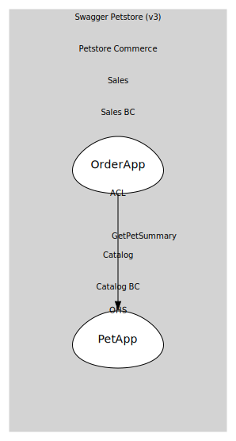

# OrderApp
Open-host service for /store/order endpoints

## Provides

### (operation) - PlaceOrder [open-host-service]
POST /store/order

### (operation) - GetOrderById [open-host-service]
GET /store/order/{orderId}

### (operation) - DeleteOrder [open-host-service]
DELETE /store/order/{orderId}

## Consumes

### GetPetSummary [anti-corruption-layer]
Internal: {id,name,status} for ACL checks
- **Provider**: [PetApp](../../../../../catalog/boundedcontexts/catalog_bc/services/pet_app/index.md)

	
