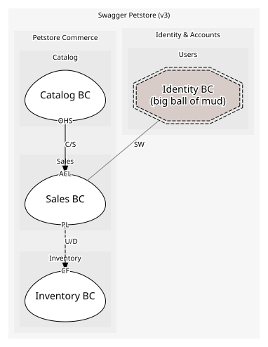

# Sales (core)
Orders and order lifecycle

## Bounded Contexts

### [Sales BC](../../../../boundedcontexts/sales_bc/index.md)
Owns Order aggregate & order-facing operations

## Context Relationships
| Upstream | Relationship | Downstream | Upstream Roles | Downstream Roles |
| --- | --- | --- | --- | --- |
| Catalog BC | customer-supplier | Sales BC | open-host-service | anti-corruption-layer |
| Identity BC | separate-ways | Sales BC | - | - |
| Sales BC | upstream-downstream (implied) | Inventory BC | published-language | conformist |

## Consumptions
| Consumer | Consumed As | Provider | Consumable | Provided As |
| --- | --- | --- | --- | --- |
| [OrderApp](../../../../boundedcontexts/sales_bc/services/order_app/index.md) | anti-corruption-layer | PetApp | GetPetSummary | open-host-service |
| [InventoryProjection](../../../../boundedcontexts/inventory_bc/aggregates/inventory_projection/index.md) | conformist | Order | OrderApproved | published-language |
| [InventoryProjection](../../../../boundedcontexts/inventory_bc/aggregates/inventory_projection/index.md) | conformist | Order | OrderDelivered | published-language |
| [InventoryProjection](../../../../boundedcontexts/inventory_bc/aggregates/inventory_projection/index.md) | conformist | Order | OrderDeleted | published-language |
	
	
