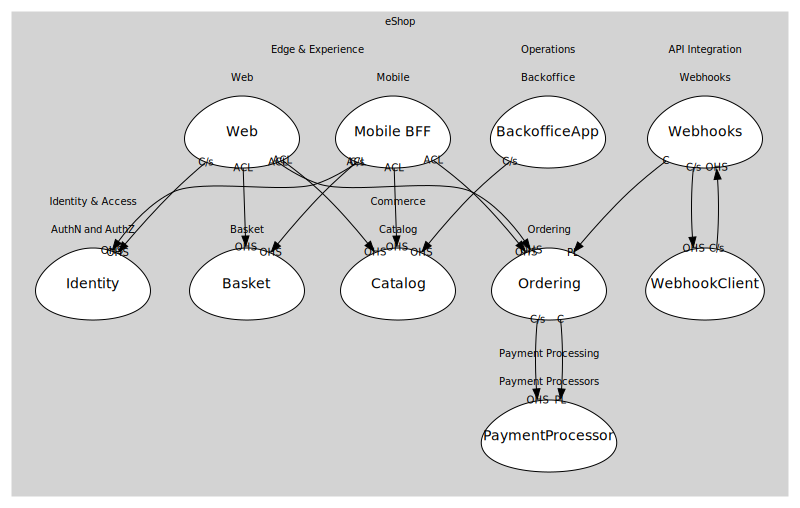

# eShop
DDD workspace for the current dotnet/eShop reference app (.NET 9, .NET Aspire).

## Domains

### [Commerce](../domains/commerce/index.md) (core)
Core e-commerce capabilities (catalog, basket, ordering).

### [Identity & Access](../domains/identity_&_access/index.md) (supporting)
Authentication/authorization via Duende IdentityServer.

### [API Integration](../domains/api_integration/index.md) (supporting)
Cross-cutting integration (webhooks, external processors).

### [Payment Processing](../domains/payment_processing/index.md) (supporting)
External payment processor integration.

### [Edge & Experience](../domains/edge_&_experience/index.md) (supporting)
Customer-facing web app and mobile BFF.

### [Operations](../domains/operations/index.md) (supporting)
Backoffice and admin operations.

## Relationships
| Consumer | Consumed As | Provider | Consumable | Provided As |
| --- | --- | --- | --- | --- |
| [WebApp](../domains/edge_&_experience/subdomains/web/boundedcontexts/web/services/web_app/index.md) | anti-corruption-layer | CatalogService | GetCatalogItems | open-host-service |
| [ShoppingBff](../domains/edge_&_experience/subdomains/mobile/boundedcontexts/mobile_bff/services/shopping_bff/index.md) | anti-corruption-layer | CatalogService | GetCatalogItems | open-host-service |
| [Backoffice](../domains/operations/subdomains/backoffice/boundedcontexts/backoffice_app/services/backoffice/index.md) | customer-supplier | CatalogService | ChangePrice | open-host-service |
| [WebApp](../domains/edge_&_experience/subdomains/web/boundedcontexts/web/services/web_app/index.md) | anti-corruption-layer | BasketService | GetBasket | open-host-service |
| [ShoppingBff](../domains/edge_&_experience/subdomains/mobile/boundedcontexts/mobile_bff/services/shopping_bff/index.md) | anti-corruption-layer | BasketService | GetBasket | open-host-service |
| [WebApp](../domains/edge_&_experience/subdomains/web/boundedcontexts/web/services/web_app/index.md) | anti-corruption-layer | BasketService | AddItem | open-host-service |
| [ShoppingBff](../domains/edge_&_experience/subdomains/mobile/boundedcontexts/mobile_bff/services/shopping_bff/index.md) | anti-corruption-layer | BasketService | AddItem | open-host-service |
| [WebApp](../domains/edge_&_experience/subdomains/web/boundedcontexts/web/services/web_app/index.md) | anti-corruption-layer | BasketService | ClearBasket | open-host-service |
| [ShoppingBff](../domains/edge_&_experience/subdomains/mobile/boundedcontexts/mobile_bff/services/shopping_bff/index.md) | anti-corruption-layer | BasketService | ClearBasket | open-host-service |
| [WebApp](../domains/edge_&_experience/subdomains/web/boundedcontexts/web/services/web_app/index.md) | anti-corruption-layer | OrderingService | PlaceOrder | open-host-service |
| [ShoppingBff](../domains/edge_&_experience/subdomains/mobile/boundedcontexts/mobile_bff/services/shopping_bff/index.md) | anti-corruption-layer | OrderingService | PlaceOrder | open-host-service |
| [WebhooksService](../domains/api_integration/subdomains/webhooks/boundedcontexts/webhooks/services/webhooks_service/index.md) | conformist | OrderingService | OrderPaid | published-language |
| [OrderingService](../domains/commerce/subdomains/ordering/boundedcontexts/ordering/services/ordering_service/index.md) | customer-supplier | PaymentService | ProcessPayment | open-host-service |
| [OrderingService](../domains/commerce/subdomains/ordering/boundedcontexts/ordering/services/ordering_service/index.md) | conformist | PaymentService | PaymentSucceeded | published-language |
| [WebApp](../domains/edge_&_experience/subdomains/web/boundedcontexts/web/services/web_app/index.md) | customer-supplier | IdentityService | IssueToken | open-host-service |
| [ShoppingBff](../domains/edge_&_experience/subdomains/mobile/boundedcontexts/mobile_bff/services/shopping_bff/index.md) | customer-supplier | IdentityService | IssueToken | open-host-service |
| [WebhookReceiver](../domains/api_integration/subdomains/webhooks/boundedcontexts/webhook_client/services/webhook_receiver/index.md) | customer-supplier | WebhooksService | RegisterWebhook | open-host-service |
| [WebhooksService](../domains/api_integration/subdomains/webhooks/boundedcontexts/webhooks/services/webhooks_service/index.md) | customer-supplier | WebhookReceiver | ReceiveWebhook | open-host-service |
	

