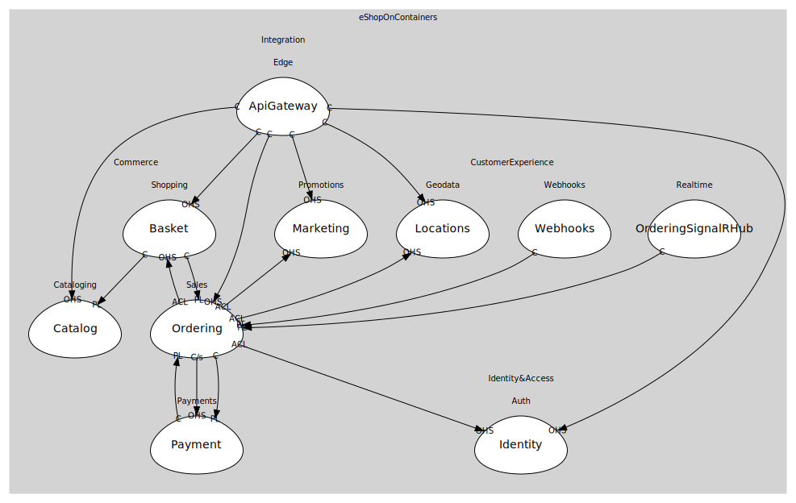

# eShopOnContainers
DDD workspace for eShopOnContainers: Catalog, Basket, Ordering, Identity, Payment, Marketing, Locations, Webhooks, API Gateways/Aggregators, SignalR hub.

## Domains

### [Commerce](../domains/commerce/index.md) (core)
Storefront core

### [CustomerExperience](../domains/customer_experience/index.md) (supporting)
Marketing, locations, webhooks, realtime

### [Identity&Access](../domains/identity&access/index.md) (supporting)
AuthN/AuthZ, buyer identity

### [Integration](../domains/integration/index.md) (generic)
API gateway + aggregators at the edge

## Relationships
| Consumer | Consumed As | Provider | Consumable | Provided As |
| --- | --- | --- | --- | --- |
| [OcelotGateway](../domains/integration/subdomains/edge/boundedcontexts/api_gateway/services/ocelot_gateway/index.md) | conformist | CatalogService | GetProduct | open-host-service |
| [WebShoppingAggregator](../domains/integration/subdomains/edge/boundedcontexts/api_gateway/services/web_shopping_aggregator/index.md) | conformist | CatalogService | SearchProducts | open-host-service |
| [BasketService](../domains/commerce/subdomains/shopping/boundedcontexts/basket/services/basket_service/index.md) | conformist | CatalogService | ProductPriceChanged | published-language |
| [WebShoppingAggregator](../domains/integration/subdomains/edge/boundedcontexts/api_gateway/services/web_shopping_aggregator/index.md) | conformist | BasketService | GetBasket | open-host-service |
| [OcelotGateway](../domains/integration/subdomains/edge/boundedcontexts/api_gateway/services/ocelot_gateway/index.md) | conformist | BasketService | GetBasket | open-host-service |
| [OrderingApp](../domains/commerce/subdomains/sales/boundedcontexts/ordering/services/ordering_app/index.md) | anti-corruption-layer | BasketService | GetBasket | open-host-service |
| [BasketService](../domains/commerce/subdomains/shopping/boundedcontexts/basket/services/basket_service/index.md) | conformist | OrderingApp | OrderStarted | published-language |
| [PaymentService](../domains/commerce/subdomains/payments/boundedcontexts/payment/services/payment_service/index.md) | conformist | OrderingApp | OrderStarted | published-language |
| [WebShoppingAggregator](../domains/integration/subdomains/edge/boundedcontexts/api_gateway/services/web_shopping_aggregator/index.md) | conformist | OrderingApp | PlaceOrder | open-host-service |
| [OcelotGateway](../domains/integration/subdomains/edge/boundedcontexts/api_gateway/services/ocelot_gateway/index.md) | conformist | OrderingApp | PlaceOrder | open-host-service |
| [OrderingApp](../domains/commerce/subdomains/sales/boundedcontexts/ordering/services/ordering_app/index.md) | anti-corruption-layer | IdentityService | IssueToken | open-host-service |
| [OcelotGateway](../domains/integration/subdomains/edge/boundedcontexts/api_gateway/services/ocelot_gateway/index.md) | conformist | IdentityService | IssueToken | open-host-service |
| [OrderingApp](../domains/commerce/subdomains/sales/boundedcontexts/ordering/services/ordering_app/index.md) | anti-corruption-layer | MarketingService | ApplyCampaigns | open-host-service |
| [MobileShoppingAggregator](../domains/integration/subdomains/edge/boundedcontexts/api_gateway/services/mobile_shopping_aggregator/index.md) | conformist | MarketingService | ApplyCampaigns | open-host-service |
| [OrderingApp](../domains/commerce/subdomains/sales/boundedcontexts/ordering/services/ordering_app/index.md) | anti-corruption-layer | LocationsService | ResolveLocation | open-host-service |
| [MobileShoppingAggregator](../domains/integration/subdomains/edge/boundedcontexts/api_gateway/services/mobile_shopping_aggregator/index.md) | conformist | LocationsService | ResolveLocation | open-host-service |
| [WebhooksService](../domains/customer_experience/subdomains/webhooks/boundedcontexts/webhooks/services/webhooks_service/index.md) | conformist | OrderingWorkflow | OrderStatusChanged | published-language |
| [SignalRHub](../domains/customer_experience/subdomains/realtime/boundedcontexts/ordering_signal_rhub/services/signal_rhub/index.md) | conformist | OrderingWorkflow | OrderStatusChanged | published-language |
| [OrderingWorkflow](../domains/commerce/subdomains/sales/boundedcontexts/ordering/services/ordering_workflow/index.md) | customer-supplier | PaymentService | AuthorizePayment | open-host-service |
| [OrderingWorkflow](../domains/commerce/subdomains/sales/boundedcontexts/ordering/services/ordering_workflow/index.md) | customer-supplier | PaymentService | CapturePayment | open-host-service |
| [OrderingWorkflow](../domains/commerce/subdomains/sales/boundedcontexts/ordering/services/ordering_workflow/index.md) | conformist | PaymentService | PaymentStatusChanged | published-language |
	

