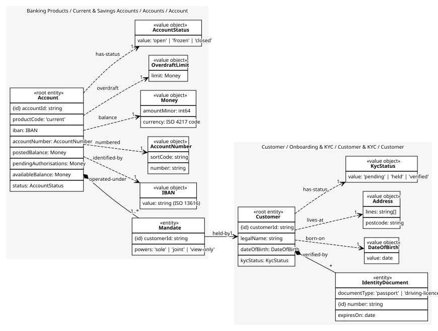
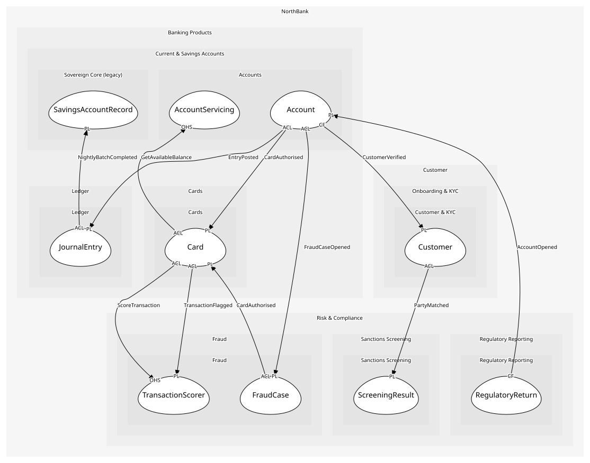

# Account
One product with its mandates, limit and status; the rules about balance and status are checked here

## Entities and Value Objects
| Type | Name | Description | Attributes |
| --- | --- | --- | --- |
| Entity (Root) | **Account** | A current or savings account | **accountId**: `string`, productCode: `'current' | 'savings'`, iban: `IBAN`, accountNumber: `AccountNumber`, availableBalance: `Money`, status: `AccountStatus` |
| Entity | Mandate | A customer's authority to operate the account; an entity because it is granted and revoked over time | **customerId**: `string`, powers: `'sole' | 'joint' | 'view-only'` |
| Value Object | IBAN | Country, check digits, bank and account identifiers; valid only if the mod-97 checksum holds | value: `string (ISO 13616)` |
| Value Object | AccountNumber | Sort code and eight-digit number; part of the shared kernel library | sortCode: `string`, number: `string` |
| Value Object | Money | Minor units and an ISO 4217 code. Never a float; the shared kernel library is the one implementation | amountMinor: `int64`, currency: `ISO 4217 code` |
| Value Object | OverdraftLimit | How far below zero the available balance may go; zero for savings | limit: `Money` |
| Value Object | AccountStatus | open, frozen or closed | value: `'open' | 'frozen' | 'closed'` |

## Relationships
| Source | Description | Target | Relation | Cardinality |
| --- | --- | --- | --- | --- |
| [Account](entities/account/index.md) | operated-under | Account - Mandate | includes | 1..* |
| [Mandate](entities/mandate/index.md) | held-by | Customer - Customer | references | 1 |
| [Customer](../../../customer_&_kyc/aggregates/customer/entities/customer/index.md) | verified-by | Customer - IdentityDocument | includes | * |
| [Customer](../../../customer_&_kyc/aggregates/customer/entities/customer/index.md) | born-on | Customer - DateOfBirth | uses | 1 |
| [Customer](../../../customer_&_kyc/aggregates/customer/entities/customer/index.md) | lives-at | Customer - Address | uses | 1 |
| [Customer](../../../customer_&_kyc/aggregates/customer/entities/customer/index.md) | has-status | Customer - KycStatus | uses | 1 |
| [Account](entities/account/index.md) | identified-by | Account - IBAN | uses | 1 |
| [Account](entities/account/index.md) | numbered | Account - AccountNumber | uses | 1 |
| [Account](entities/account/index.md) | balance | Account - Money | uses | 1 |
| [Account](entities/account/index.md) | overdraft | Account - OverdraftLimit | uses | 1 |
| [Account](entities/account/index.md) | has-status | Account - AccountStatus | uses | 1 |

## Invariants
| Name | Description | Constrains |
| --- | --- | --- |
| IbanChecksumValid | The IBAN's mod-97 checksum holds, or the account does not exist | IBAN |
| BalanceWithinOverdraft | The available balance never falls below minus the overdraft limit | Account.availableBalance, OverdraftLimit |
| FrozenAcceptsNoDebits | A frozen account accepts no debits until Financial Crime unfreezes it | AccountStatus |
| ClosedHasZeroBalance | An account closes only at a zero balance | AccountStatus, Account.availableBalance |
| MandateHolderIsVerified | Every mandate holder is a verified customer | Mandate |

## Provides
| Name | Type | Internal | Pattern | Description | Schema | Raises |
| --- | --- | --- | --- | --- | --- | --- |
| AccountOpened | event | no | published-language | A product exists for a verified customer | [AccountOpened](../../index.md#schemas) | - |
| AccountFrozen | event | no | published-language | Debits are blocked pending a fraud case | [AccountRef](../../index.md#schemas) | - |
| AccountClosed | event | no | published-language | The account is closed at zero balance | [AccountRef](../../index.md#schemas) | - |
| FreezeAccount | operation | no | open-host-service | Block debits; issued when Financial Crime opens a case | [AccountRef](../../index.md#schemas) | AccountFrozen |
| CloseAccount | operation | yes | - | Close at zero balance | - | AccountClosed |
| UpdateBalance | operation | yes | - | Recompute the available balance from a ledger posting | - | - |

## Consumes

### CustomerVerified [conformist]
KYC passed; accounts may be opened
- **Provider**: [Customer](../../../customer_&_kyc/aggregates/customer/index.md)

### EntryPosted [conformist]
Money moved; balances and reports follow
- **Provider**: [JournalEntry](../../../ledger/aggregates/journal_entry/index.md)

### FraudCaseOpened [anti-corruption-layer]
An investigation began; the account is frozen
- **Provider**: [FraudCase](../../../fraud/aggregates/fraud_case/index.md)

	
