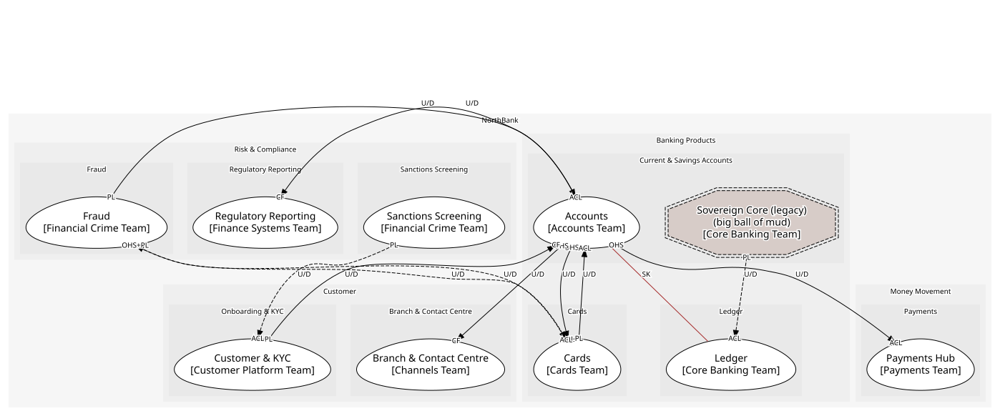
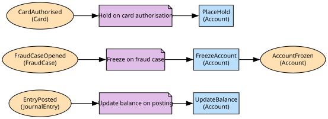

# Accounts
Current and savings accounts, mandates, overdrafts, status

**Owned by:** Accounts Team

## Serves
- [Banking Products / Current & Savings Accounts](../../domains/banking_products/subdomains/current_&_savings_accounts/index.md) (core)

## Glossary
| Term | Definition | Aliases | Embodied by |
| --- | --- | --- | --- |
| **Account** | A current or savings product held by one or more verified customers | - | Account |
| **Balance** | The available balance: posted balance less pending card authorisations. The ledger's balance is the posted one; the contact centre's is whatever the screen shows | Available balance | availableBalance |
| **Mandate** | A customer's authority to operate an account. Not a card authorisation | - | Mandate |

## Aggregates

### [Account](aggregates/account/index.md)
One product with its mandates, limit and status; the rules about balance and status are checked here

	
## Services

### [AccountServicing](services/account_servicing/index.md)
The documented account API for channels, cards and lending

## Schemas
| Name | Description | Attributes | Used by |
| --- | --- | --- | --- |
| AccountRef | - | **accountId**: `string` | AccountFrozen, AccountClosed, FreezeAccount, GetAvailableBalance |
| AccountOpened | What reporting and the ledger learn about a new account | **accountId**: `string`, iban: `IBAN`, customerId: `string`, productCode: `'current' | 'savings'` | AccountOpened |
| OpenAccount | - | customerId: `string`, productCode: `'current' | 'savings'` | OpenAccount |

## Policies

| Name | Description | On | Then |
| --- | --- | --- | --- |
| Update balance on posting | Every posting to an account recomputes its available balance | EntryPosted | UpdateBalance |
| Freeze on fraud case | An opened case freezes the account the same second | FraudCaseOpened | FreezeAccount |

## Context Relationships
| Upstream | Relationship | Downstream | Upstream Roles | Downstream Roles |
| --- | --- | --- | --- | --- |
| Customer & KYC | upstream-downstream | Accounts | published-language | conformist |
| Fraud | upstream-downstream | Accounts | published-language | anti-corruption-layer |
| Accounts | upstream-downstream | Cards | open-host-service | anti-corruption-layer |
| Accounts | upstream-downstream | Branch & Contact Centre | open-host-service | conformist |
| Accounts | upstream-downstream | Regulatory Reporting | published-language | conformist |
| Accounts | shared-kernel | Ledger | - | - |
| Sanctions Screening | upstream-downstream (implied) | Customer & KYC | published-language | anti-corruption-layer |
| Sovereign Core (legacy) | upstream-downstream (implied) | Ledger | published-language | anti-corruption-layer |
| Cards | upstream-downstream (implied) | Fraud | published-language | anti-corruption-layer |
| Fraud | upstream-downstream (implied) | Cards | open-host-service, published-language | anti-corruption-layer |

## Consumptions
| Consumer | Consumed As | Provider | Consumable | Provided As |
| --- | --- | --- | --- | --- |
| [Card](../cards/aggregates/card/index.md) | anti-corruption-layer | AccountServicing | GetAvailableBalance | open-host-service |
| [ServiceRequest](../branch_&_contact_centre/aggregates/service_request/index.md) | conformist | AccountServicing | GetAvailableBalance | open-host-service |
| [RegulatoryReturn](../regulatory_reporting/aggregates/regulatory_return/index.md) | conformist | Account | AccountOpened | published-language |
| [Account](aggregates/account/index.md) | conformist | Customer | CustomerVerified | published-language |
| [Customer](../customer_&_kyc/aggregates/customer/index.md) | anti-corruption-layer | ScreeningResult | PartyMatched | published-language |
| [Account](aggregates/account/index.md) | conformist | JournalEntry | EntryPosted | published-language |
| [JournalEntry](../ledger/aggregates/journal_entry/index.md) | anti-corruption-layer | SavingsAccountRecord | NightlyBatchCompleted | published-language |
| [Account](aggregates/account/index.md) | anti-corruption-layer | FraudCase | FraudCaseOpened | published-language |
| [FraudCase](../fraud/aggregates/fraud_case/index.md) | anti-corruption-layer | Card | CardAuthorised | published-language |
| [Card](../cards/aggregates/card/index.md) | anti-corruption-layer | TransactionScorer | ScoreTransaction | open-host-service |
| [Card](../cards/aggregates/card/index.md) | anti-corruption-layer | FraudCase | TransactionFlagged | published-language |

