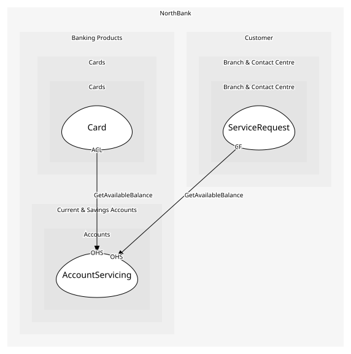

# AccountServicing
The documented account API for channels, cards and lending

## Provides
| Name | Type | Internal | Pattern | Description | Schema | Raises |
| --- | --- | --- | --- | --- | --- | --- |
| OpenAccount | operation | no | open-host-service | Open a product for a verified customer | [OpenAccount](../../index.md#schemas) | AccountOpened |
| GetAvailableBalance | operation | no | open-host-service | Posted balance less pending authorisations | [AccountRef](../../index.md#schemas) | - |

## Consumes
> No consumptions.
	
