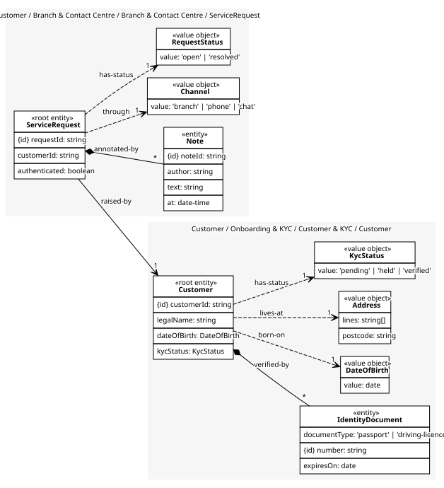
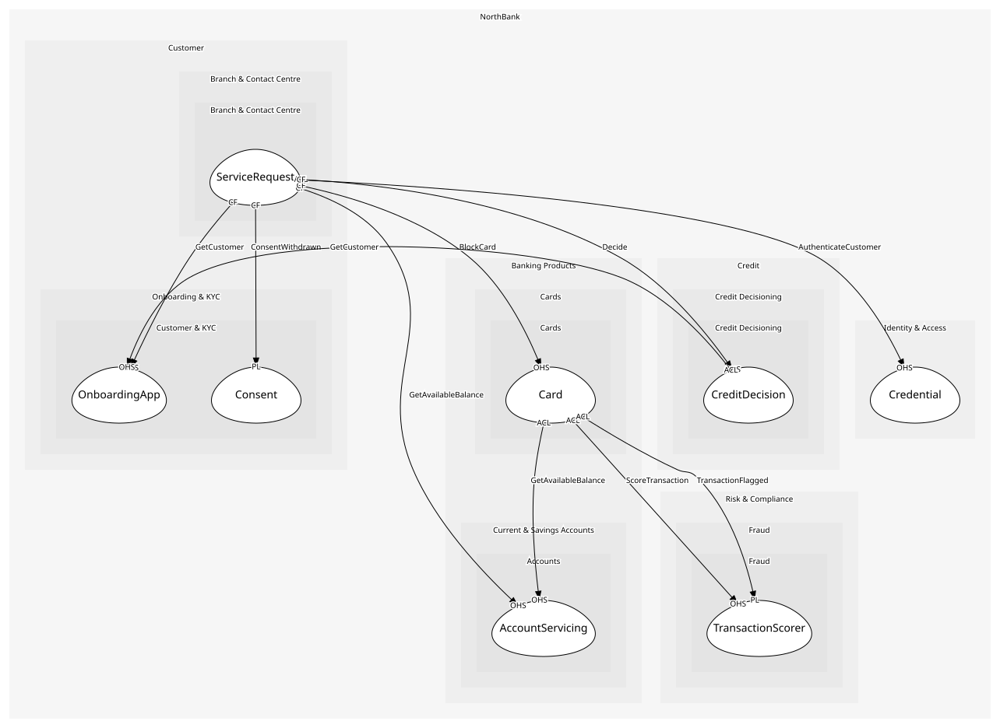

# ServiceRequest
A customer asking for something through a channel, with notes

## Entities and Value Objects
| Type | Name | Description | Attributes |
| --- | --- | --- | --- |
| Entity (Root) | **ServiceRequest** | One ask, one outcome | **requestId**: `string`, customerId: `string`, authenticated: `boolean` |
| Entity | Note | What an agent recorded; added, never edited | **noteId**: `string`, author: `string`, text: `string`, at: `date-time` |
| Value Object | Channel | branch, phone or chat | value: `'branch' | 'phone' | 'chat'` |
| Value Object | RequestStatus | open, resolved | value: `'open' | 'resolved'` |

## Relationships
| Source | Description | Target | Relation | Cardinality |
| --- | --- | --- | --- | --- |
| [ServiceRequest](entities/service_request/index.md) | annotated-by | ServiceRequest - Note | includes | * |
| [ServiceRequest](entities/service_request/index.md) | through | ServiceRequest - Channel | uses | 1 |
| [ServiceRequest](entities/service_request/index.md) | has-status | ServiceRequest - RequestStatus | uses | 1 |
| [ServiceRequest](entities/service_request/index.md) | raised-by | Customer - Customer | references | 1 |
| [Customer](../../../customer_&_kyc/aggregates/customer/entities/customer/index.md) | verified-by | Customer - IdentityDocument | includes | * |
| [Customer](../../../customer_&_kyc/aggregates/customer/entities/customer/index.md) | born-on | Customer - DateOfBirth | uses | 1 |
| [Customer](../../../customer_&_kyc/aggregates/customer/entities/customer/index.md) | lives-at | Customer - Address | uses | 1 |
| [Customer](../../../customer_&_kyc/aggregates/customer/entities/customer/index.md) | has-status | Customer - KycStatus | uses | 1 |

## Invariants
| Name | Description | Constrains |
| --- | --- | --- |
| AuthenticatedBeforeAction | Nothing is done on a request until the customer is authenticated | ServiceRequest |
| NoteImmutable | Notes are added, never edited or deleted | Note |

## Provides
| Name | Type | Internal | Pattern | Description | Schema | Raises |
| --- | --- | --- | --- | --- | --- | --- |
| ServiceRequestRaised | event | yes | - | A customer asked for something | - | - |
| RaiseRequest | operation | no | open-host-service | Open a request in a branch or on the phone | - | ServiceRequestRaised |
| SuppressMarketing | operation | yes | - | Stop every outbound contact for the customer the same day | - | - |

## Consumes

### GetCustomer [conformist]
Read a customer's verified details
- **Provider**: [OnboardingApp](../../../customer_&_kyc/services/onboarding_app/index.md)

### GetAvailableBalance [conformist]
Posted balance less pending authorisations
- **Provider**: [AccountServicing](../../../accounts/services/account_servicing/index.md)

### BlockCard [conformist]
Block a card; issued by fraud or by a customer through a channel
- **Provider**: [Card](../../../cards/aggregates/card/index.md)

### ConsentWithdrawn [conformist]
A permission ended; published the same second
- **Provider**: [Consent](../../../customer_&_kyc/aggregates/consent/index.md)

### Decide [anti-corruption-layer]
Pull the bureau, run the scorecard, check affordability
- **Provider**: [CreditDecision](../../../credit_decisioning/aggregates/credit_decision/index.md)

### AuthenticateCustomer [conformist]
Verify credentials and step-up
- **Provider**: [Credential](../../../identity_&_access/aggregates/credential/index.md)

	
