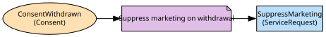

# Branch & Contact Centre
Service requests raised in branches and on the phone

**Owned by:** Channels Team

## Serves
- [Customer / Branch & Contact Centre](../../domains/customer/subdomains/branch_&_contact_centre/index.md) (supporting)

## Glossary
| Term | Definition | Aliases | Embodied by |
| --- | --- | --- | --- |
| **Request** | One customer ask tracked to an outcome | Ticket | ServiceRequest |
| **Returned payment** | A payment sent back by the payee's bank. Not a regulatory return | - | ServiceRequest |

## Aggregates

### [ServiceRequest](aggregates/service_request/index.md)
A customer asking for something through a channel, with notes

	
## Services
> No services.

## Schemas
> No schemas.

## Policies

| Name | Description | On | Then |
| --- | --- | --- | --- |
| Suppress marketing on withdrawal | A withdrawn marketing consent stops outbound contact the same day; the fix for the fine | ConsentWithdrawn | SuppressMarketing |

## Context Relationships
| Upstream | Relationship | Downstream | Upstream Roles | Downstream Roles |
| --- | --- | --- | --- | --- |
| Customer & KYC | upstream-downstream | Branch & Contact Centre | open-host-service, published-language | conformist |
| Accounts | upstream-downstream | Branch & Contact Centre | open-host-service | conformist |
| Cards | upstream-downstream | Branch & Contact Centre | open-host-service | conformist |
| Identity & Access | upstream-downstream | Branch & Contact Centre | open-host-service | conformist |
| Branch & Contact Centre | separate-ways | Credit Decisioning | - | - |
| Accounts | upstream-downstream (implied) | Cards | open-host-service | anti-corruption-layer |
| Fraud | upstream-downstream (implied) | Cards | open-host-service, published-language | anti-corruption-layer |
| Cards | upstream-downstream (implied) | Fraud | published-language | anti-corruption-layer |
| Customer & KYC | upstream-downstream (implied) | Credit Decisioning | open-host-service | anti-corruption-layer |

## Consumptions
| Consumer | Consumed As | Provider | Consumable | Provided As |
| --- | --- | --- | --- | --- |
| [ServiceRequest](aggregates/service_request/index.md) | conformist | OnboardingApp | GetCustomer | open-host-service |
| [ServiceRequest](aggregates/service_request/index.md) | conformist | AccountServicing | GetAvailableBalance | open-host-service |
| [ServiceRequest](aggregates/service_request/index.md) | conformist | Card | BlockCard | open-host-service |
| [Card](../cards/aggregates/card/index.md) | anti-corruption-layer | AccountServicing | GetAvailableBalance | open-host-service |
| [Card](../cards/aggregates/card/index.md) | anti-corruption-layer | TransactionScorer | ScoreTransaction | open-host-service |
| [Card](../cards/aggregates/card/index.md) | anti-corruption-layer | FraudCase | TransactionFlagged | published-language |
| [FraudCase](../fraud/aggregates/fraud_case/index.md) | anti-corruption-layer | Card | CardAuthorised | published-language |
| [ServiceRequest](aggregates/service_request/index.md) | conformist | Consent | ConsentWithdrawn | published-language |
| [ServiceRequest](aggregates/service_request/index.md) | anti-corruption-layer | CreditDecision | Decide | open-host-service |
| [CreditDecision](../credit_decisioning/aggregates/credit_decision/index.md) | anti-corruption-layer | OnboardingApp | GetCustomer | open-host-service |
| [ServiceRequest](aggregates/service_request/index.md) | conformist | Credential | AuthenticateCustomer | open-host-service |

