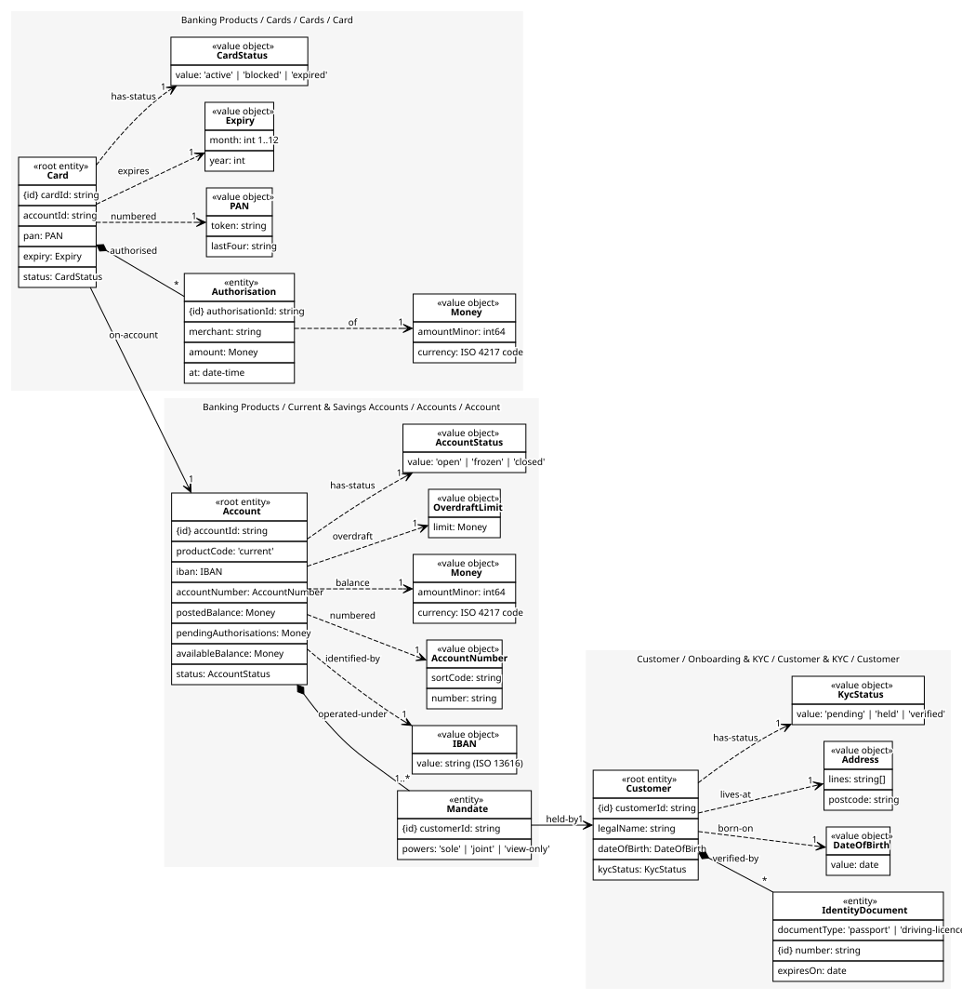
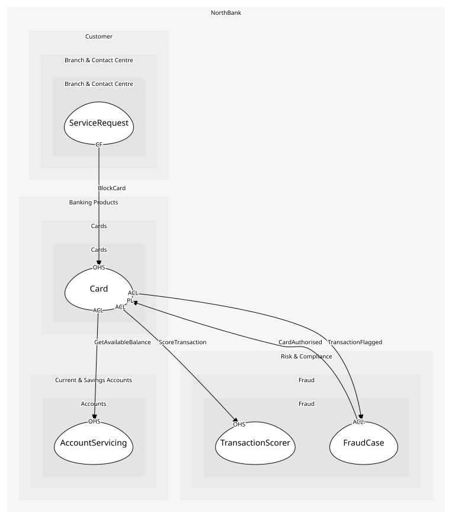

# Card
An issued card and its authorisations; the checks on a card need both

## Entities and Value Objects
| Type | Name | Description | Attributes |
| --- | --- | --- | --- |
| Entity (Root) | **Card** | One physical or virtual card on one account | **cardId**: `string`, accountId: `string`, pan: `PAN`, expiry: `Expiry`, status: `CardStatus` |
| Entity | Authorisation | A merchant's approved request to take an amount; an entity because it is later captured or expires | **authorisationId**: `string`, merchant: `string`, amount: `Money`, at: `date-time` |
| Value Object | PAN | The card number, held as a token plus last four; the full number passes Luhn | token: `string`, lastFour: `string` |
| Value Object | Expiry | Month and year after which nothing authorises | month: `int 1..12`, year: `int` |
| Value Object | CardStatus | active, blocked, expired | value: `'active' | 'blocked' | 'expired'` |
| Value Object | Money | Minor units and an ISO 4217 code. Never a float; the shared kernel library is the one implementation | amountMinor: `int64`, currency: `ISO 4217 code` |

## Relationships
| Source | Description | Target | Relation | Cardinality |
| --- | --- | --- | --- | --- |
| [Card](entities/card/index.md) | authorised | Card - Authorisation | includes | * |
| [Authorisation](entities/authorisation/index.md) | of | Card - Money | uses | 1 |
| [Card](entities/card/index.md) | numbered | Card - PAN | uses | 1 |
| [Card](entities/card/index.md) | expires | Card - Expiry | uses | 1 |
| [Card](entities/card/index.md) | has-status | Card - CardStatus | uses | 1 |
| [Card](entities/card/index.md) | on-account | Account - Account | references | 1 |
| [Account](../../../accounts/aggregates/account/entities/account/index.md) | operated-under | Account - Mandate | includes | 1..* |
| [Mandate](../../../accounts/aggregates/account/entities/mandate/index.md) | held-by | Customer - Customer | references | 1 |
| [Customer](../../../customer_&_kyc/aggregates/customer/entities/customer/index.md) | verified-by | Customer - IdentityDocument | includes | * |
| [Customer](../../../customer_&_kyc/aggregates/customer/entities/customer/index.md) | born-on | Customer - DateOfBirth | uses | 1 |
| [Customer](../../../customer_&_kyc/aggregates/customer/entities/customer/index.md) | lives-at | Customer - Address | uses | 1 |
| [Customer](../../../customer_&_kyc/aggregates/customer/entities/customer/index.md) | has-status | Customer - KycStatus | uses | 1 |
| [Account](../../../accounts/aggregates/account/entities/account/index.md) | identified-by | Account - IBAN | uses | 1 |
| [Account](../../../accounts/aggregates/account/entities/account/index.md) | numbered | Account - AccountNumber | uses | 1 |
| [Account](../../../accounts/aggregates/account/entities/account/index.md) | balance | Account - Money | uses | 1 |
| [Account](../../../accounts/aggregates/account/entities/account/index.md) | overdraft | Account - OverdraftLimit | uses | 1 |
| [Account](../../../accounts/aggregates/account/entities/account/index.md) | has-status | Account - AccountStatus | uses | 1 |

## Invariants
| Name | Description | Constrains |
| --- | --- | --- |
| PanLuhnValid | The full card number passes the Luhn check | PAN |
| NoAuthOnBlockedCard | A blocked card authorises nothing | CardStatus, Authorisation |
| ExpiredCardNoAuth | Past expiry, nothing authorises | Expiry, Authorisation |
| AuthWithinAvailableBalance | An authorisation never exceeds the account's available balance | Authorisation |

## Provides
| Name | Type | Internal | Pattern | Description | Schema | Raises |
| --- | --- | --- | --- | --- | --- | --- |
| CardAuthorised | event | no | published-language | A merchant's request was approved | [CardEvent](../../index.md#schemas) | - |
| CardBlocked | event | no | published-language | The card authorises nothing until unblocked | [CardEvent](../../index.md#schemas) | - |
| AuthoriseCard | operation | no | open-host-service | Approve or decline a merchant's request from CardCo | [CardAuthorisationRequest](../../index.md#schemas) | CardAuthorised |
| BlockCard | operation | no | open-host-service | Block a card; issued by fraud or by a customer through a channel | [CardEvent](../../index.md#schemas) | CardBlocked |
| IssueCard | operation | yes | - | Issue a card on an account | - | - |

## Consumes

### GetAvailableBalance [anti-corruption-layer]
Posted balance less pending authorisations
- **Provider**: [AccountServicing](../../../accounts/services/account_servicing/index.md)

### ScoreTransaction [anti-corruption-layer]
Score synchronously; callers wait on the verdict
- **Provider**: [TransactionScorer](../../../fraud/services/transaction_scorer/index.md)

### TransactionFlagged [anti-corruption-layer]
Above threshold; the caller stops the transaction
- **Provider**: [FraudCase](../../../fraud/aggregates/fraud_case/index.md)

	
