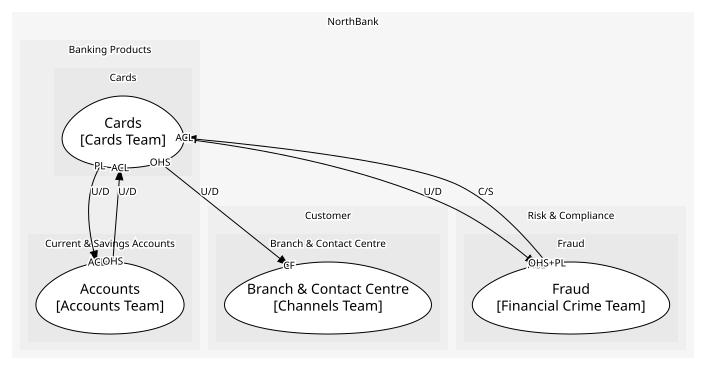
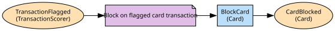

# Cards
Issued cards and their authorisations, via CardCo

**Owned by:** Cards Team

## Serves
- [Banking Products / Cards](../../domains/banking_products/subdomains/cards/index.md) (generic)

## Glossary
| Term | Definition | Aliases | Embodied by |
| --- | --- | --- | --- |
| **PAN** | The card number; held as a token and the last four digits | - | PAN |
| **Authorisation** | A merchant's approved request to take an amount. Not a mandate | - | Authorisation |
| **Payment** | A card transaction. The Payments Hub's payment is an instruction to a payee | - | Authorisation |

## Aggregates

### [Card](aggregates/card/index.md)
An issued card and its authorisations; the checks on a card need both

	
## Services
> No services.

## Schemas
| Name | Description | Attributes | Used by |
| --- | --- | --- | --- |
| CardAuthorisationRequest | CardCo's format, translated on the way in | panToken: `string`, merchant: `string`, amount: `Money` | AuthoriseCard |
| CardEvent | Card and account; shared by the card events | **cardId**: `string`, accountId: `string` | CardAuthorised, CardBlocked, BlockCard |

## Policies

| Name | Description | On | Then |
| --- | --- | --- | --- |
| Block on flagged card transaction | A flag on a card-channel transaction blocks the card | TransactionFlagged | BlockCard |

## Context Relationships
| Upstream | Relationship | Downstream | Upstream Roles | Downstream Roles |
| --- | --- | --- | --- | --- |
| Fraud | customer-supplier | Cards | open-host-service, published-language | anti-corruption-layer |
| Cards | upstream-downstream | Fraud | published-language | anti-corruption-layer |
| Accounts | upstream-downstream | Cards | open-host-service | anti-corruption-layer |
| Cards | upstream-downstream | Branch & Contact Centre | open-host-service | conformist |

## Consumptions
| Consumer | Consumed As | Provider | Consumable | Provided As |
| --- | --- | --- | --- | --- |
| [FraudCase](../fraud/aggregates/fraud_case/index.md) | anti-corruption-layer | Card | CardAuthorised | published-language |
| [ServiceRequest](../branch_&_contact_centre/aggregates/service_request/index.md) | conformist | Card | BlockCard | open-host-service |
| [Card](aggregates/card/index.md) | anti-corruption-layer | AccountServicing | GetAvailableBalance | open-host-service |
| [Card](aggregates/card/index.md) | anti-corruption-layer | TransactionScorer | ScoreTransaction | open-host-service |
| [Card](aggregates/card/index.md) | anti-corruption-layer | FraudCase | TransactionFlagged | published-language |

