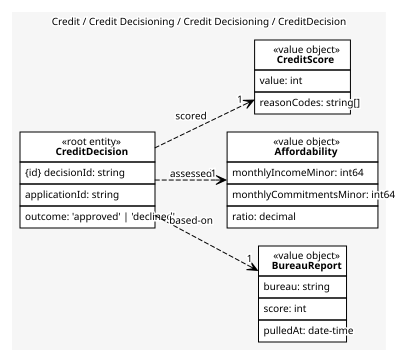
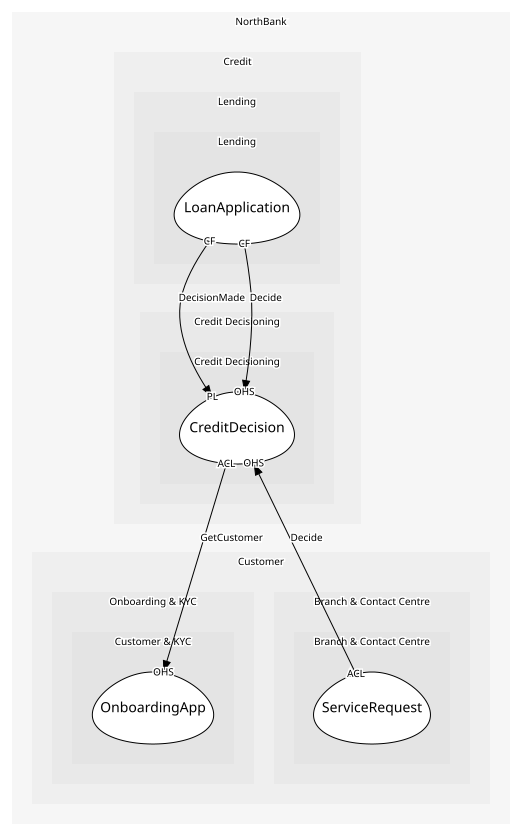

# CreditDecision
One decision and the evidence behind it, kept so it can be explained

## Entities and Value Objects
| Type | Name | Description | Attributes |
| --- | --- | --- | --- |
| Entity (Root) | **CreditDecision** | The outcome for one application | **decisionId**: `string`, applicationId: `string`, outcome: `'approved' | 'declined'` |
| Value Object | BureauReport | The external credit file at a moment in time | bureau: `string`, score: `int`, pulledAt: `date-time` |
| Value Object | Affordability | Monthly income, commitments and their ratio | monthlyIncomeMinor: `int64`, monthlyCommitmentsMinor: `int64`, ratio: `decimal` |
| Value Object | CreditScore | The scorecard's output with the reason codes | value: `int`, reasonCodes: `string[]` |

## Relationships
| Source | Description | Target | Relation | Cardinality |
| --- | --- | --- | --- | --- |
| [CreditDecision](entities/credit_decision/index.md) | based-on | CreditDecision - BureauReport | uses | 1 |
| [CreditDecision](entities/credit_decision/index.md) | assessed | CreditDecision - Affordability | uses | 1 |
| [CreditDecision](entities/credit_decision/index.md) | scored | CreditDecision - CreditScore | uses | 1 |

## Invariants
| Name | Description | Constrains |
| --- | --- | --- |
| AffordabilityRatioCap | Commitments over income at most forty-five percent for an approval | Affordability |
| DecisionExplained | Every decision carries reason codes; the customer is entitled to them | CreditScore |
| BureauReportFresh | The bureau report is no older than thirty days | BureauReport |

## Provides
| Name | Type | Internal | Pattern | Description | Schema | Raises |
| --- | --- | --- | --- | --- | --- | --- |
| DecisionMade | event | no | published-language | Yes or no, with reasons | [DecisionMade](../../index.md#schemas) | - |
| Decide | operation | no | open-host-service | Pull the bureau, run the scorecard, check affordability | [DecisionRequest](../../index.md#schemas) | DecisionMade |

## Consumes

### GetCustomer [anti-corruption-layer]
Read a customer's verified details
- **Provider**: [OnboardingApp](../../../customer_&_kyc/services/onboarding_app/index.md)

	
