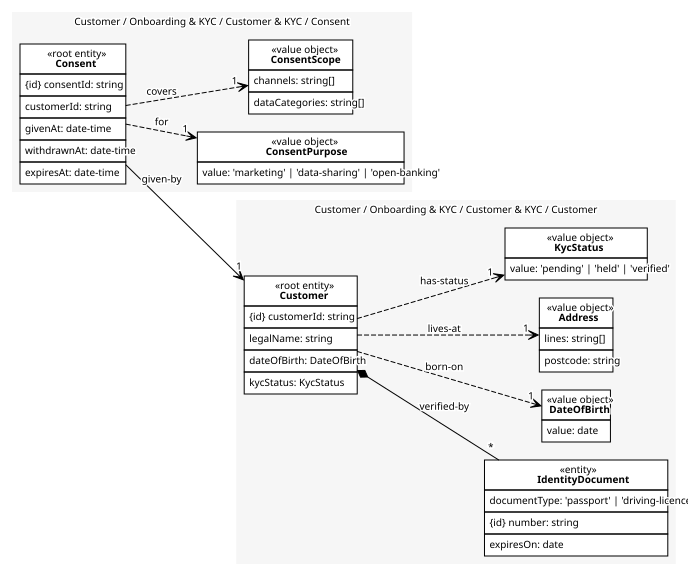
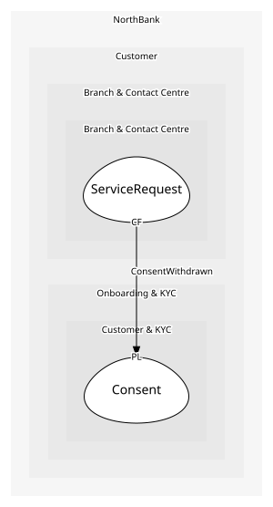

# Consent
One permission with a purpose, a scope and a lifetime; its own aggregate because it changes independently of the customer record

## Entities and Value Objects
| Type | Name | Description | Attributes |
| --- | --- | --- | --- |
| Entity (Root) | **Consent** | A permission given, and possibly withdrawn, by a customer | **consentId**: `string`, customerId: `string`, givenAt: `date-time`, withdrawnAt: `date-time`, expiresAt: `date-time` |
| Value Object | ConsentPurpose | marketing, data-sharing or open-banking; the purpose decides the rules | value: `'marketing' | 'data-sharing' | 'open-banking'` |
| Value Object | ConsentScope | Channels and data categories the permission covers | channels: `string[]`, dataCategories: `string[]` |

## Relationships
| Source | Description | Target | Relation | Cardinality |
| --- | --- | --- | --- | --- |
| [Customer](../customer/entities/customer/index.md) | verified-by | Customer - IdentityDocument | includes | * |
| [Customer](../customer/entities/customer/index.md) | born-on | Customer - DateOfBirth | uses | 1 |
| [Customer](../customer/entities/customer/index.md) | lives-at | Customer - Address | uses | 1 |
| [Customer](../customer/entities/customer/index.md) | has-status | Customer - KycStatus | uses | 1 |
| [Consent](entities/consent/index.md) | for | Consent - ConsentPurpose | uses | 1 |
| [Consent](entities/consent/index.md) | covers | Consent - ConsentScope | uses | 1 |
| [Consent](entities/consent/index.md) | given-by | Customer - Customer | references | 1 |

## Invariants
| Name | Description | Constrains |
| --- | --- | --- |
| WithdrawnIsFinal | A withdrawn consent is never reinstated; a new consent is given instead | Consent.withdrawnAt |
| PurposeRequired | A consent without a purpose is not a consent | ConsentPurpose |
| OpenBankingConsentExpires | An open banking consent expires within twelve months of being given | Consent.expiresAt, ConsentPurpose |

## Provides
| Name | Type | Internal | Pattern | Description | Schema | Raises |
| --- | --- | --- | --- | --- | --- | --- |
| ConsentGiven | event | no | published-language | A permission now exists | [ConsentChanged](../../index.md#schemas) | - |
| ConsentWithdrawn | event | no | published-language | A permission ended; published the same second | [ConsentChanged](../../index.md#schemas) | - |
| GiveConsent | operation | no | open-host-service | Record a permission | [ConsentChanged](../../index.md#schemas) | ConsentGiven |
| WithdrawConsent | operation | no | open-host-service | End a permission, finally | [ConsentChanged](../../index.md#schemas) | ConsentWithdrawn |

## Consumes
> No consumptions.
	
