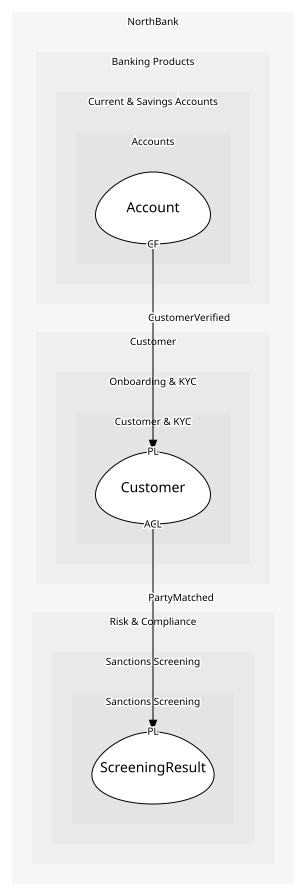

# Customer
A verified person and the documents that verify them

## Entities and Value Objects
| Type | Name | Description | Attributes |
| --- | --- | --- | --- |
| Entity (Root) | **Customer** | Someone the bank has verified | **customerId**: `string`, legalName: `string`, dateOfBirth: `DateOfBirth`, kycStatus: `KycStatus` |
| Entity | IdentityDocument | A passport or licence checked during onboarding; kept for audit | documentType: `'passport' | 'driving-licence'`, **number**: `string`, expiresOn: `date` |
| Value Object | DateOfBirth | A date; the source of the age rule | value: `date` |
| Value Object | Address | Residential address, verified against the electoral roll | lines: `string[]`, postcode: `string` |
| Value Object | KycStatus | pending, held (sanctions match), verified | value: `'pending' | 'held' | 'verified'` |

## Relationships
| Source | Description | Target | Relation | Cardinality |
| --- | --- | --- | --- | --- |
| [Customer](entities/customer/index.md) | verified-by | Customer - IdentityDocument | includes | * |
| [Customer](entities/customer/index.md) | born-on | Customer - DateOfBirth | uses | 1 |
| [Customer](entities/customer/index.md) | lives-at | Customer - Address | uses | 1 |
| [Customer](entities/customer/index.md) | has-status | Customer - KycStatus | uses | 1 |
| [Consent](../consent/entities/consent/index.md) | for | Consent - ConsentPurpose | uses | 1 |
| [Consent](../consent/entities/consent/index.md) | covers | Consent - ConsentScope | uses | 1 |
| [Consent](../consent/entities/consent/index.md) | given-by | Customer - Customer | references | 1 |

## Invariants
| Name | Description | Constrains |
| --- | --- | --- |
| AdultOnly | A customer is eighteen or over on the day onboarding starts, computed from the date of birth; no exceptions | Customer |
| VerifiedNeedsDocument | A verified customer has at least one identity document on file | KycStatus, IdentityDocument |
| DocumentNotExpired | A document past its expiry does not count towards verification | IdentityDocument.expiresOn |

## Provides
| Name | Type | Internal | Pattern | Description | Schema | Raises |
| --- | --- | --- | --- | --- | --- | --- |
| OnboardingStarted | event | yes | - | A prospective customer gave their details | - | - |
| CustomerVerified | event | no | published-language | KYC passed; accounts may be opened | [CustomerVerified](../../index.md#schemas) | - |
| VerifyCustomer | operation | yes | - | Mark KYC as passed once documents and screening are clear | - | CustomerVerified |
| HoldOnboarding | operation | yes | - | Stop everything until Financial Crime clears the match | - | - |

## Consumes

### PartyMatched [anti-corruption-layer]
The name matched a list; the caller stops
- **Provider**: [ScreeningResult](../../../sanctions_screening/aggregates/screening_result/index.md)

	
