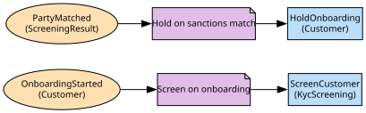

# Customer & KYC
Verified customers, their documents and their consents

**Owned by:** Customer Platform Team

## Serves
- [Customer / Onboarding & KYC](../../domains/customer/subdomains/onboarding_&_kyc/index.md) (supporting)
- [Customer / Consent](../../domains/customer/subdomains/consent/index.md) (supporting)

## Glossary
| Term | Definition | Aliases | Embodied by |
| --- | --- | --- | --- |
| **Customer** | A verified person. Branches say member; payments say party | Member, Party | Customer |
| **KYC** | Know your customer: the verification that must pass before any account opens | - | KycStatus |
| **Consent** | A permission with a purpose, a scope and a lifetime; withdrawal is final | - | Consent |

## Aggregates

### [Customer](aggregates/customer/index.md)
A verified person and the documents that verify them

### [Consent](aggregates/consent/index.md)
One permission with a purpose, a scope and a lifetime; its own aggregate because it changes independently of the customer record

	
## Services

### [OnboardingApp](services/onboarding_app/index.md)
The onboarding journey and the customer read API

### [KycScreening](services/kyc_screening/index.md)
Runs sanctions and document checks; a domain service because it spans the customer and the screening result

## Schemas
| Name | Description | Attributes | Used by |
| --- | --- | --- | --- |
| CustomerRef | - | **customerId**: `string` | GetCustomer |
| CustomerVerified | - | **customerId**: `string`, verifiedAt: `date-time` | CustomerVerified |
| ConsentChanged | Used by both consent events; the contact centre acts on it the same day | **consentId**: `string`, customerId: `string`, purpose: `ConsentPurpose` | ConsentGiven, ConsentWithdrawn, GiveConsent, WithdrawConsent |

## Policies

| Name | Description | On | Then |
| --- | --- | --- | --- |
| Screen on onboarding | Every prospective customer is screened before anything else | OnboardingStarted | ScreenCustomer |
| Hold on sanctions match | A match holds onboarding until Financial Crime clears it | PartyMatched | HoldOnboarding |

## Context Relationships
| Upstream | Relationship | Downstream | Upstream Roles | Downstream Roles |
| --- | --- | --- | --- | --- |
| Sanctions Screening | upstream-downstream | Customer & KYC | open-host-service, published-language | anti-corruption-layer |
| Customer & KYC | upstream-downstream | Accounts | published-language | conformist |
| Customer & KYC | upstream-downstream | Lending | open-host-service | anti-corruption-layer |
| Customer & KYC | upstream-downstream | Credit Decisioning | open-host-service | anti-corruption-layer |
| Customer & KYC | upstream-downstream | Branch & Contact Centre | open-host-service, published-language | conformist |

## Consumptions
| Consumer | Consumed As | Provider | Consumable | Provided As |
| --- | --- | --- | --- | --- |
| [LoanApplication](../lending/aggregates/loan_application/index.md) | anti-corruption-layer | OnboardingApp | GetCustomer | open-host-service |
| [CreditDecision](../credit_decisioning/aggregates/credit_decision/index.md) | anti-corruption-layer | OnboardingApp | GetCustomer | open-host-service |
| [ServiceRequest](../branch_&_contact_centre/aggregates/service_request/index.md) | conformist | OnboardingApp | GetCustomer | open-host-service |
| [KycScreening](services/kyc_screening/index.md) | anti-corruption-layer | ScreeningResult | ScreenParty | open-host-service |
| [Account](../accounts/aggregates/account/index.md) | conformist | Customer | CustomerVerified | published-language |
| [Customer](aggregates/customer/index.md) | anti-corruption-layer | ScreeningResult | PartyMatched | published-language |
| [ServiceRequest](../branch_&_contact_centre/aggregates/service_request/index.md) | conformist | Consent | ConsentWithdrawn | published-language |

