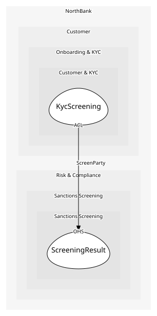

# KycScreening
Runs sanctions and document checks; a domain service because it spans the customer and the screening result

## Provides
| Name | Type | Internal | Pattern | Description | Schema | Raises |
| --- | --- | --- | --- | --- | --- | --- |
| ScreenCustomer | operation | yes | - | Screen the prospective customer against sanctions lists | - | - |

## Consumes

### ScreenParty [anti-corruption-layer]
Check a name, date of birth and country against the lists
- **Provider**: [ScreeningResult](../../../sanctions_screening/aggregates/screening_result/index.md)

	
