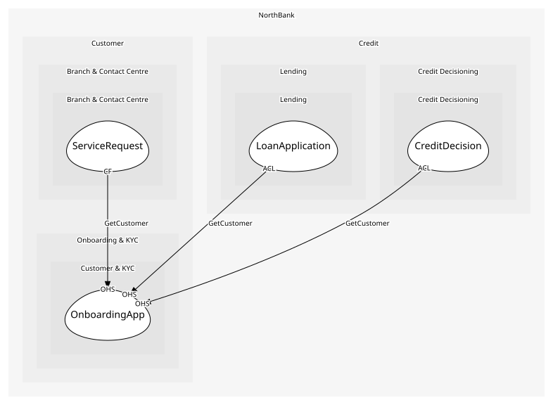

# OnboardingApp
The onboarding journey and the customer read API

## Provides
| Name | Type | Internal | Pattern | Description | Schema | Raises |
| --- | --- | --- | --- | --- | --- | --- |
| StartOnboarding | operation | no | open-host-service | Begin with name, date of birth, address and a document | - | OnboardingStarted |
| GetCustomer | operation | no | open-host-service | Read a customer's verified details | [CustomerRef](../../index.md#schemas) | - |

## Consumes
> No consumptions.
	
