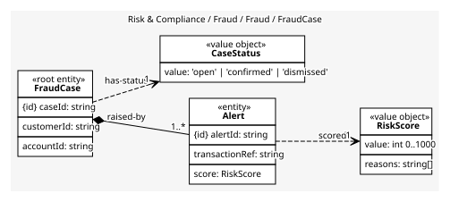
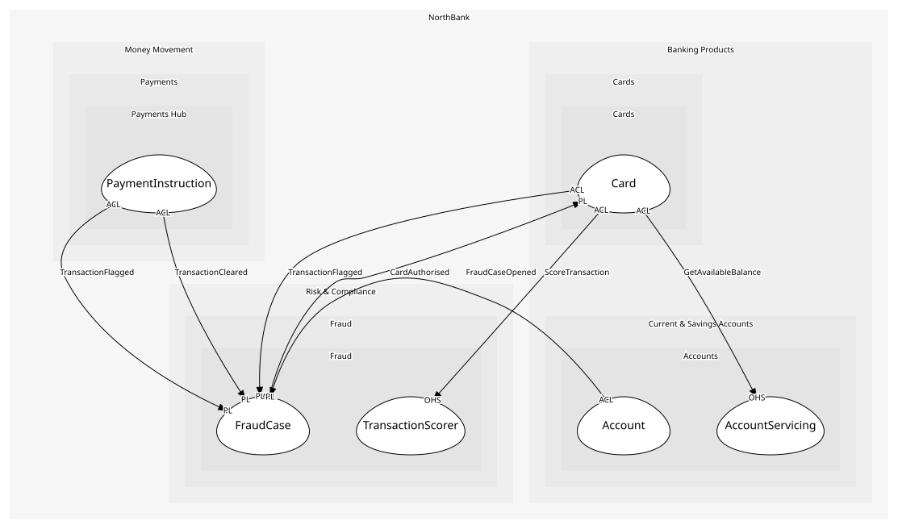

# FraudCase
A suspected fraud and the alerts behind it

## Entities and Value Objects
| Type | Name | Description | Attributes |
| --- | --- | --- | --- |
| Entity (Root) | **FraudCase** | One investigation | **caseId**: `string`, customerId: `string`, accountId: `string` |
| Entity | Alert | One flagged transaction with its score | **alertId**: `string`, transactionRef: `string`, score: `RiskScore` |
| Value Object | RiskScore | 0 to 1000 with the reasons that produced it | value: `int 0..1000`, reasons: `string[]` |
| Value Object | CaseStatus | open, confirmed, dismissed | value: `'open' | 'confirmed' | 'dismissed'` |

## Relationships
| Source | Description | Target | Relation | Cardinality |
| --- | --- | --- | --- | --- |
| [FraudCase](entities/fraud_case/index.md) | raised-by | FraudCase - Alert | includes | 1..* |
| [Alert](entities/alert/index.md) | scored | FraudCase - RiskScore | uses | 1 |
| [FraudCase](entities/fraud_case/index.md) | has-status | FraudCase - CaseStatus | uses | 1 |

## Invariants
| Name | Description | Constrains |
| --- | --- | --- |
| CaseHasAlert | A case always has at least one alert | FraudCase, Alert |
| ScoreExplained | A score carries its reasons, because the customer may be entitled to them | RiskScore |

## Provides
| Name | Type | Internal | Pattern | Description | Schema | Raises |
| --- | --- | --- | --- | --- | --- | --- |
| TransactionFlagged | event | no | published-language | Above threshold; the caller stops the transaction | [TransactionVerdict](../../index.md#schemas) | - |
| TransactionCleared | event | no | published-language | Below threshold; the caller proceeds | [TransactionVerdict](../../index.md#schemas) | - |
| FraudCaseOpened | event | no | published-language | An investigation began; the account is frozen | [FraudCaseOpened](../../index.md#schemas) | - |
| OpenCase | operation | yes | - | Open a case with the flagged transaction as its first alert | - | FraudCaseOpened |
| CloseCase | operation | yes | - | Confirm or dismiss | - | - |

## Consumes

### CardAuthorised [anti-corruption-layer]
A merchant's request was approved
- **Provider**: [Card](../../../cards/aggregates/card/index.md)

	
