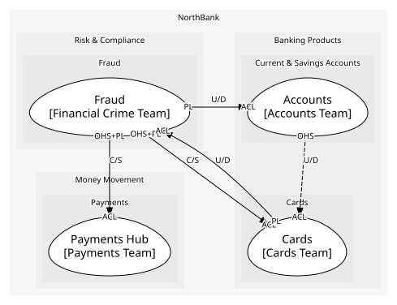
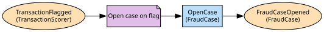

# Fraud
The transaction scorer and fraud cases

**Owned by:** Financial Crime Team

## Serves
- [Risk & Compliance / Fraud](../../domains/risk_&_compliance/subdomains/fraud/index.md) (core)

## Glossary
| Term | Definition | Aliases | Embodied by |
| --- | --- | --- | --- |
| **Alert** | One flagged transaction and its score | - | Alert |
| **APP scam** | An authorised push payment the customer was tricked into making; reimbursable, so every missed flag costs the bank | - | TransactionScorer |

## Aggregates

### [FraudCase](aggregates/fraud_case/index.md)
A suspected fraud and the alerts behind it

	
## Services

### [TransactionScorer](services/transaction_scorer/index.md)
The bank's own model; a domain service because it reads across every customer's history

## Schemas
| Name | Description | Attributes | Used by |
| --- | --- | --- | --- |
| ScoreTransaction | What the scorer needs: the transaction, its channel, amount and payee | **transactionRef**: `string`, channel: `'payment' | 'card'`, amountMinor: `int64`, payeeIban: `string` | ScoreTransaction |
| TransactionVerdict | Shared by flagged and cleared | **transactionRef**: `string`, channel: `'payment' | 'card'`, score: `RiskScore` | TransactionFlagged, TransactionCleared |
| FraudCaseOpened | - | **caseId**: `string`, accountId: `string` | FraudCaseOpened |

## Policies

| Name | Description | On | Then |
| --- | --- | --- | --- |
| Open case on flag | Every flag becomes a case with the alert attached | TransactionFlagged | OpenCase |

## Context Relationships
| Upstream | Relationship | Downstream | Upstream Roles | Downstream Roles |
| --- | --- | --- | --- | --- |
| Fraud | customer-supplier | Payments Hub | open-host-service, published-language | anti-corruption-layer |
| Fraud | customer-supplier | Cards | open-host-service, published-language | anti-corruption-layer |
| Cards | upstream-downstream | Fraud | published-language | anti-corruption-layer |
| Fraud | upstream-downstream | Accounts | published-language | anti-corruption-layer |
| Accounts | upstream-downstream (implied) | Cards | open-host-service | anti-corruption-layer |

## Consumptions
| Consumer | Consumed As | Provider | Consumable | Provided As |
| --- | --- | --- | --- | --- |
| [PaymentInstruction](../payments_hub/aggregates/payment_instruction/index.md) | anti-corruption-layer | TransactionScorer | TransactionFlagged | published-language |
| [Card](../cards/aggregates/card/index.md) | anti-corruption-layer | TransactionScorer | TransactionFlagged | published-language |
| [PaymentInstruction](../payments_hub/aggregates/payment_instruction/index.md) | anti-corruption-layer | TransactionScorer | TransactionCleared | published-language |
| [PaymentInstruction](../payments_hub/aggregates/payment_instruction/index.md) | anti-corruption-layer | TransactionScorer | ScoreTransaction | open-host-service |
| [Card](../cards/aggregates/card/index.md) | anti-corruption-layer | TransactionScorer | ScoreTransaction | open-host-service |
| [Account](../accounts/aggregates/account/index.md) | anti-corruption-layer | FraudCase | FraudCaseOpened | published-language |
| [FraudCase](aggregates/fraud_case/index.md) | anti-corruption-layer | Card | CardAuthorised | published-language |
| [Card](../cards/aggregates/card/index.md) | anti-corruption-layer | AccountServicing | GetAvailableBalance | open-host-service |

