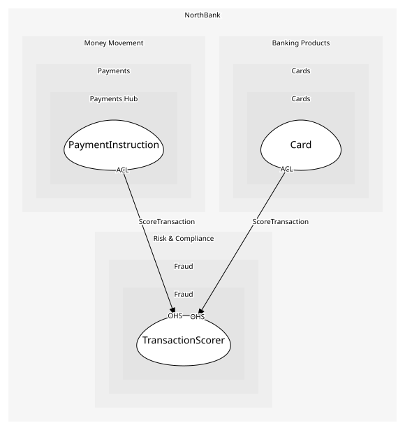

# TransactionScorer
The bank's own model; a domain service because it reads across every customer's history

## Provides
| Name | Type | Internal | Pattern | Description | Schema | Raises |
| --- | --- | --- | --- | --- | --- | --- |
| TransactionFlagged | event | no | published-language | Above threshold; the caller stops the transaction | [TransactionVerdict](../../index.md#schemas) | - |
| TransactionCleared | event | no | published-language | Below threshold; the caller proceeds | [TransactionVerdict](../../index.md#schemas) | - |
| ScoreTransaction | operation | no | open-host-service | Score synchronously; callers wait on the verdict | [ScoreTransaction](../../index.md#schemas) | TransactionFlagged, TransactionCleared |

## Consumes
> No consumptions.
	
