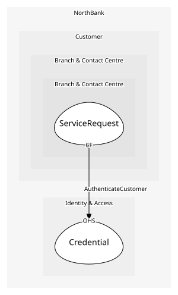

# Credential
A customer's login

## Entities and Value Objects
| Type | Name | Description | Attributes |
| --- | --- | --- | --- |
| Entity (Root) | **Credential** | Username and step-up factors for one customer | **customerId**: `string`, username: `string`, stepUpEnrolled: `boolean` |

## Relationships

## Invariants
> No invariants.

## Provides
| Name | Type | Internal | Pattern | Description | Schema | Raises |
| --- | --- | --- | --- | --- | --- | --- |
| CustomerAuthenticated | event | no | published-language | A customer proved who they are on a channel | - | - |
| AuthenticateCustomer | operation | no | open-host-service | Verify credentials and step-up | - | CustomerAuthenticated |

## Consumes
> No consumptions.
	
