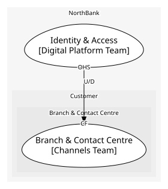

# Identity & Access
Usernames, credentials, step-up authentication

**Owned by:** Digital Platform Team

## Serves
> No subdomains.

## Glossary
> No glossary terms.

## Aggregates

### [Credential](aggregates/credential/index.md)
A customer's login

	
## Services
> No services.

## Schemas
> No schemas.

## Policies
> No policies.

## Context Relationships
| Upstream | Relationship | Downstream | Upstream Roles | Downstream Roles |
| --- | --- | --- | --- | --- |
| Identity & Access | upstream-downstream | Branch & Contact Centre | open-host-service | conformist |

## Consumptions
| Consumer | Consumed As | Provider | Consumable | Provided As |
| --- | --- | --- | --- | --- |
| [ServiceRequest](../branch_&_contact_centre/aggregates/service_request/index.md) | conformist | Credential | AuthenticateCustomer | open-host-service |

