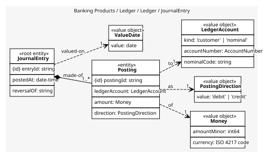
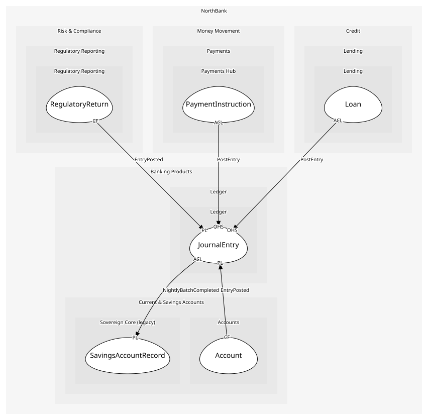

# JournalEntry
Postings that balance; the whole entry posts or nothing does

## Entities and Value Objects
| Type | Name | Description | Attributes |
| --- | --- | --- | --- |
| Entity (Root) | **JournalEntry** | One balanced movement of money | **entryId**: `string`, postedAt: `date-time`, reversalOf: `string` |
| Entity | Posting | A debit or credit of an amount to one ledger account | **postingId**: `string`, ledgerAccount: `LedgerAccount`, amount: `Money`, direction: `PostingDirection` |
| Value Object | Money | Minor units and an ISO 4217 code. Never a float; the shared kernel library is the one implementation | amountMinor: `int64`, currency: `ISO 4217 code` |
| Value Object | AccountNumber | Sort code and eight-digit number; the shared kernel library, so it is the same value Accounts holds | sortCode: `string`, number: `string` |
| Value Object | LedgerAccount | Where a posting lands: a customer account by its AccountNumber, or a nominal from the chart of accounts (loan book, scheme suspense, fee income) | kind: `'customer' | 'nominal'`, accountNumber: `AccountNumber`, nominalCode: `string` |
| Value Object | PostingDirection | debit or credit | value: `'debit' | 'credit'` |
| Value Object | ValueDate | The date the money counts from, which may differ from the posting date | value: `date` |

## Relationships
| Source | Description | Target | Relation | Cardinality |
| --- | --- | --- | --- | --- |
| [JournalEntry](entities/journal_entry/index.md) | made-of | JournalEntry - Posting | includes | 1..* |
| [Posting](entities/posting/index.md) | of | JournalEntry - Money | uses | 1 |
| [Posting](entities/posting/index.md) | as | JournalEntry - PostingDirection | uses | 1 |
| [Posting](entities/posting/index.md) | to | JournalEntry - LedgerAccount | uses | 1 |
| [JournalEntry](entities/journal_entry/index.md) | valued-on | JournalEntry - ValueDate | uses | 1 |

## Invariants
| Name | Description | Constrains |
| --- | --- | --- |
| EntryBalances | The debits of an entry equal its credits, or it does not post | Posting |
| AtLeastTwoPostings | An entry has at least two postings | JournalEntry |
| SingleCurrencyPerEntry | Every posting in an entry shares one currency | Money |
| ImmutableOncePosted | A posted entry is never changed; it is reversed by another entry | JournalEntry |

## Provides
| Name | Type | Internal | Pattern | Description | Schema | Raises |
| --- | --- | --- | --- | --- | --- | --- |
| EntryPosted | event | no | published-language | Money moved; balances and reports follow | [EntryPosted](../../index.md#schemas) | - |
| PostEntry | operation | no | open-host-service | Post a balanced entry | [PostEntry](../../index.md#schemas) | EntryPosted |
| ReverseEntry | operation | no | open-host-service | Post the opposite entry against an earlier one | [PostEntry](../../index.md#schemas) | EntryPosted |
| ImportBatchPostings | operation | yes | - | Translate each line of Sovereign's batch file into an entry | - | EntryPosted |

## Consumes

### NightlyBatchCompleted [anti-corruption-layer]
The day's savings movements are in the batch file
- **Provider**: [SavingsAccountRecord](../../../sovereign_core_(legacy)/aggregates/savings_account_record/index.md)

	
