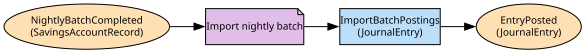

# Ledger
Balanced, immutable journal entries

**Owned by:** Core Banking Team

## Serves
- [Banking Products / Ledger](../../domains/banking_products/subdomains/ledger/index.md) (supporting)

## Glossary
| Term | Definition | Aliases | Embodied by |
| --- | --- | --- | --- |
| **Posting** | One side of a movement: a debit or credit to one account | - | Posting |
| **Entry** | A balanced set of postings. Lending calls the disbursement one a drawdown | Journal | JournalEntry |
| **Value date** | The date money counts from, which may differ from when it was posted | - | ValueDate |

## Aggregates

### [JournalEntry](aggregates/journal_entry/index.md)
Postings that balance; the whole entry posts or nothing does

	
## Services
> No services.

## Schemas
| Name | Description | Attributes | Used by |
| --- | --- | --- | --- |
| PostEntry | The postings a caller wants made, as one balanced entry | postings: `{accountId, amount, direction}[]`, valueDate: `ValueDate` | PostEntry, ReverseEntry |
| EntryPosted | - | **entryId**: `string`, postings: `{accountId, amount, direction}[]` | EntryPosted |

## Policies

| Name | Description | On | Then |
| --- | --- | --- | --- |
| Import nightly batch | Each line of the batch file becomes a ledger entry | NightlyBatchCompleted | ImportBatchPostings |

## Context Relationships
| Upstream | Relationship | Downstream | Upstream Roles | Downstream Roles |
| --- | --- | --- | --- | --- |
| Ledger | customer-supplier | Payments Hub | open-host-service | anti-corruption-layer |
| Ledger | customer-supplier | Lending | open-host-service | anti-corruption-layer |
| Ledger | upstream-downstream | Regulatory Reporting | published-language | conformist |
| Sovereign Core (legacy) | upstream-downstream | Ledger | published-language | anti-corruption-layer |
| Accounts | shared-kernel | Ledger | - | - |

## Consumptions
| Consumer | Consumed As | Provider | Consumable | Provided As |
| --- | --- | --- | --- | --- |
| [Account](../accounts/aggregates/account/index.md) | conformist | JournalEntry | EntryPosted | published-language |
| [RegulatoryReturn](../regulatory_reporting/aggregates/regulatory_return/index.md) | conformist | JournalEntry | EntryPosted | published-language |
| [PaymentInstruction](../payments_hub/aggregates/payment_instruction/index.md) | anti-corruption-layer | JournalEntry | PostEntry | open-host-service |
| [Loan](../lending/aggregates/loan/index.md) | anti-corruption-layer | JournalEntry | PostEntry | open-host-service |
| [JournalEntry](aggregates/journal_entry/index.md) | anti-corruption-layer | SavingsAccountRecord | NightlyBatchCompleted | published-language |

