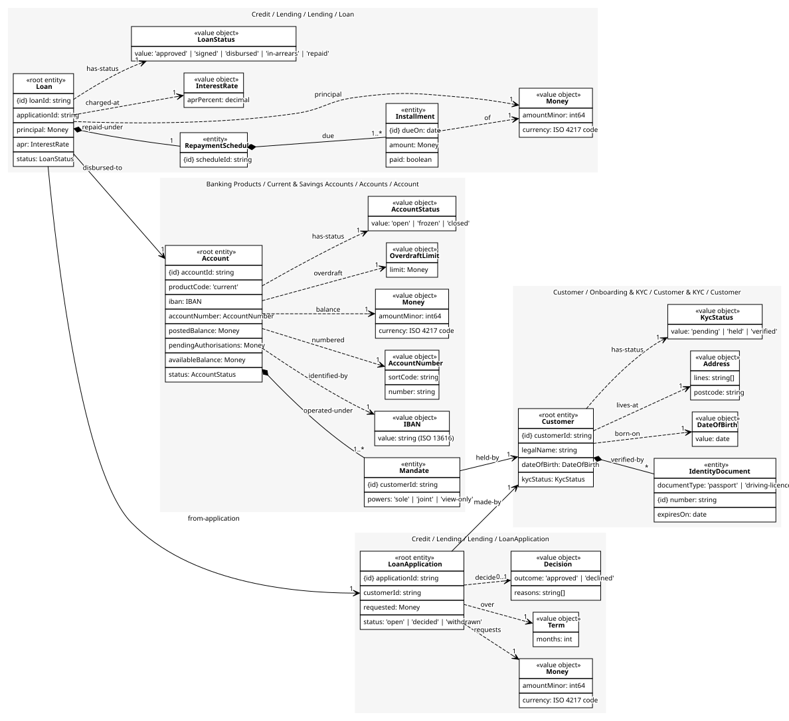
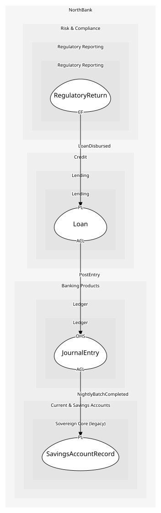

# Loan
A signed agreement, its schedule and its installments; the schedule is checked against the principal

## Entities and Value Objects
| Type | Name | Description | Attributes |
| --- | --- | --- | --- |
| Entity (Root) | **Loan** | Money lent under a signed agreement | **loanId**: `string`, applicationId: `string`, principal: `Money`, apr: `InterestRate`, status: `LoanStatus` |
| Entity | Installment | One due payment | **dueOn**: `date`, amount: `Money`, paid: `boolean` |
| Entity | RepaymentSchedule | The plan of installments; an entity because it is re-cut on arrears | **scheduleId**: `string` |
| Value Object | Money | Minor units and an ISO 4217 code. Never a float; the shared kernel library is the one implementation | amountMinor: `int64`, currency: `ISO 4217 code` |
| Value Object | InterestRate | Annual percentage rate, within the regulatory cap | aprPercent: `decimal` |
| Value Object | LoanStatus | approved, signed, disbursed, in-arrears, repaid | value: `'approved' | 'signed' | 'disbursed' | 'in-arrears' | 'repaid'` |

## Relationships
| Source | Description | Target | Relation | Cardinality |
| --- | --- | --- | --- | --- |
| [LoanApplication](../loan_application/entities/loan_application/index.md) | requests | LoanApplication - Money | uses | 1 |
| [LoanApplication](../loan_application/entities/loan_application/index.md) | over | LoanApplication - Term | uses | 1 |
| [LoanApplication](../loan_application/entities/loan_application/index.md) | decided | LoanApplication - Decision | uses | 0..1 |
| [LoanApplication](../loan_application/entities/loan_application/index.md) | made-by | Customer - Customer | references | 1 |
| [Customer](../../../customer_&_kyc/aggregates/customer/entities/customer/index.md) | verified-by | Customer - IdentityDocument | includes | * |
| [Customer](../../../customer_&_kyc/aggregates/customer/entities/customer/index.md) | born-on | Customer - DateOfBirth | uses | 1 |
| [Customer](../../../customer_&_kyc/aggregates/customer/entities/customer/index.md) | lives-at | Customer - Address | uses | 1 |
| [Customer](../../../customer_&_kyc/aggregates/customer/entities/customer/index.md) | has-status | Customer - KycStatus | uses | 1 |
| [Loan](entities/loan/index.md) | repaid-under | Loan - RepaymentSchedule | includes | 1 |
| [RepaymentSchedule](entities/repayment_schedule/index.md) | due | Loan - Installment | includes | 1..* |
| [Installment](entities/installment/index.md) | of | Loan - Money | uses | 1 |
| [Loan](entities/loan/index.md) | principal | Loan - Money | uses | 1 |
| [Loan](entities/loan/index.md) | charged-at | Loan - InterestRate | uses | 1 |
| [Loan](entities/loan/index.md) | has-status | Loan - LoanStatus | uses | 1 |
| [Loan](entities/loan/index.md) | from-application | LoanApplication - LoanApplication | references | 1 |
| [Loan](entities/loan/index.md) | disbursed-to | Account - Account | references | 1 |
| [Account](../../../accounts/aggregates/account/entities/account/index.md) | operated-under | Account - Mandate | includes | 1..* |
| [Mandate](../../../accounts/aggregates/account/entities/mandate/index.md) | held-by | Customer - Customer | references | 1 |
| [Account](../../../accounts/aggregates/account/entities/account/index.md) | identified-by | Account - IBAN | uses | 1 |
| [Account](../../../accounts/aggregates/account/entities/account/index.md) | numbered | Account - AccountNumber | uses | 1 |
| [Account](../../../accounts/aggregates/account/entities/account/index.md) | balance | Account - Money | uses | 1 |
| [Account](../../../accounts/aggregates/account/entities/account/index.md) | overdraft | Account - OverdraftLimit | uses | 1 |
| [Account](../../../accounts/aggregates/account/entities/account/index.md) | has-status | Account - AccountStatus | uses | 1 |

## Invariants
| Name | Description | Constrains |
| --- | --- | --- |
| NoDrawdownBeforeSignature | Nothing is disbursed before the agreement is signed | LoanStatus |
| AprWithinCap | The APR never exceeds the regulatory cap | InterestRate |
| InstallmentsSumToPrincipalPlusInterest | The schedule's installments sum to principal plus interest | Installment, RepaymentSchedule |
| ArrearsAfterMissedInstallment | A missed installment puts the loan in arrears | LoanStatus, Installment |

## Provides
| Name | Type | Internal | Pattern | Description | Schema | Raises |
| --- | --- | --- | --- | --- | --- | --- |
| LoanAgreementSigned | event | yes | - | The customer signed; disbursement may proceed | - | - |
| LoanDisbursed | event | no | published-language | The principal reached the account; the ledger posts and reporting counts it | [LoanEvent](../../index.md#schemas) | - |
| InstallmentMissed | event | no | published-language | A due installment was not paid | [LoanEvent](../../index.md#schemas) | - |
| ArrearsNoticeIssued | event | yes | - | The customer was told the loan is in arrears | - | - |
| SignAgreement | operation | no | open-host-service | Record the signed agreement and create the loan | [LoanEvent](../../index.md#schemas) | LoanAgreementSigned |
| Disburse | operation | yes | - | Pay the principal into the customer's account | - | LoanDisbursed |
| MarkInstallmentMissed | operation | yes | - | Record a missed due date and move the loan into arrears | - | InstallmentMissed |
| IssueArrearsNotice | operation | yes | - | Send the regulatory arrears notice | - | ArrearsNoticeIssued |

## Consumes

### PostEntry [anti-corruption-layer]
Post a balanced entry
- **Provider**: [JournalEntry](../../../ledger/aggregates/journal_entry/index.md)

	
