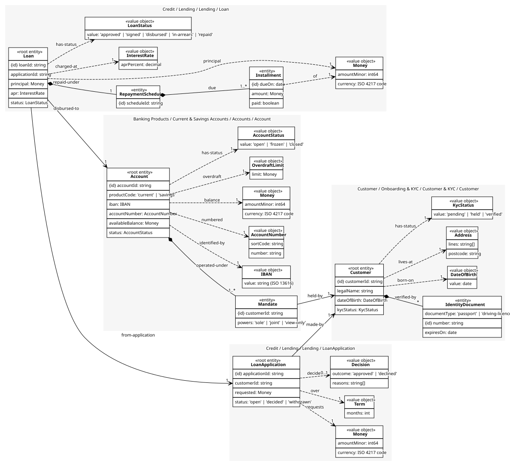
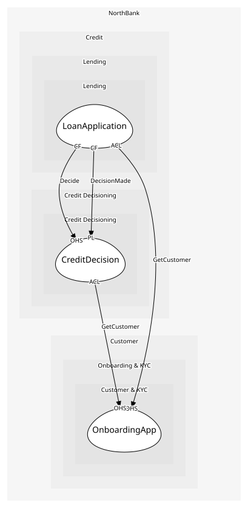

# LoanApplication
A customer asking for an amount over a term, and the decision on it

## Entities and Value Objects
| Type | Name | Description | Attributes |
| --- | --- | --- | --- |
| Entity (Root) | **LoanApplication** | One request for credit | **applicationId**: `string`, customerId: `string`, requested: `Money`, status: `'open' | 'decided' | 'withdrawn'` |
| Value Object | Money | Minor units and an ISO 4217 code. Never a float; the shared kernel library is the one implementation | amountMinor: `int64`, currency: `ISO 4217 code` |
| Value Object | Term | Months to repay over | months: `int` |
| Value Object | Decision | approved or declined, with the reasons the customer is entitled to | outcome: `'approved' | 'declined'`, reasons: `string[]` |

## Relationships
| Source | Description | Target | Relation | Cardinality |
| --- | --- | --- | --- | --- |
| [LoanApplication](entities/loan_application/index.md) | requests | LoanApplication - Money | uses | 1 |
| [LoanApplication](entities/loan_application/index.md) | over | LoanApplication - Term | uses | 1 |
| [LoanApplication](entities/loan_application/index.md) | decided | LoanApplication - Decision | uses | 0..1 |
| [LoanApplication](entities/loan_application/index.md) | made-by | Customer - Customer | references | 1 |
| [Customer](../../../customer_&_kyc/aggregates/customer/entities/customer/index.md) | verified-by | Customer - IdentityDocument | includes | * |
| [Customer](../../../customer_&_kyc/aggregates/customer/entities/customer/index.md) | born-on | Customer - DateOfBirth | uses | 1 |
| [Customer](../../../customer_&_kyc/aggregates/customer/entities/customer/index.md) | lives-at | Customer - Address | uses | 1 |
| [Customer](../../../customer_&_kyc/aggregates/customer/entities/customer/index.md) | has-status | Customer - KycStatus | uses | 1 |
| [Loan](../loan/entities/loan/index.md) | repaid-under | Loan - RepaymentSchedule | includes | 1 |
| [RepaymentSchedule](../loan/entities/repayment_schedule/index.md) | due | Loan - Installment | includes | 1..* |
| [Installment](../loan/entities/installment/index.md) | of | Loan - Money | uses | 1 |
| [Loan](../loan/entities/loan/index.md) | principal | Loan - Money | uses | 1 |
| [Loan](../loan/entities/loan/index.md) | charged-at | Loan - InterestRate | uses | 1 |
| [Loan](../loan/entities/loan/index.md) | has-status | Loan - LoanStatus | uses | 1 |
| [Loan](../loan/entities/loan/index.md) | from-application | LoanApplication - LoanApplication | references | 1 |
| [Loan](../loan/entities/loan/index.md) | disbursed-to | Account - Account | references | 1 |
| [Account](../../../accounts/aggregates/account/entities/account/index.md) | operated-under | Account - Mandate | includes | 1..* |
| [Mandate](../../../accounts/aggregates/account/entities/mandate/index.md) | held-by | Customer - Customer | references | 1 |
| [Account](../../../accounts/aggregates/account/entities/account/index.md) | identified-by | Account - IBAN | uses | 1 |
| [Account](../../../accounts/aggregates/account/entities/account/index.md) | numbered | Account - AccountNumber | uses | 1 |
| [Account](../../../accounts/aggregates/account/entities/account/index.md) | balance | Account - Money | uses | 1 |
| [Account](../../../accounts/aggregates/account/entities/account/index.md) | overdraft | Account - OverdraftLimit | uses | 1 |
| [Account](../../../accounts/aggregates/account/entities/account/index.md) | has-status | Account - AccountStatus | uses | 1 |

## Invariants
| Name | Description | Constrains |
| --- | --- | --- |
| OneOpenApplicationPerCustomer | A customer has at most one open application; SubmitApplication refuses a second while one is open | LoanApplication |

## Provides
| Name | Type | Internal | Pattern | Description | Schema | Raises |
| --- | --- | --- | --- | --- | --- | --- |
| ApplicationSubmitted | event | no | published-language | A customer asked for credit; decisioning runs | [ApplicationSubmitted](../../index.md#schemas) | - |
| LoanApproved | event | yes | - | Decisioning said yes; an offer follows (out of scope) | - | - |
| ApplicationDeclined | event | yes | - | Decisioning said no, with reasons | - | - |
| SubmitApplication | operation | no | open-host-service | Ask for an amount over a term | [ApplicationSubmitted](../../index.md#schemas) | ApplicationSubmitted |
| RecordDecision | operation | yes | - | Store decisioning's outcome and reasons | - | LoanApproved, ApplicationDeclined |

## Consumes

### GetCustomer [anti-corruption-layer]
Read a customer's verified details
- **Provider**: [OnboardingApp](../../../customer_&_kyc/services/onboarding_app/index.md)

### Decide [conformist]
Pull the bureau, run the scorecard, check affordability
- **Provider**: [CreditDecision](../../../credit_decisioning/aggregates/credit_decision/index.md)

### DecisionMade [conformist]
Yes or no, with reasons
- **Provider**: [CreditDecision](../../../credit_decisioning/aggregates/credit_decision/index.md)

	
