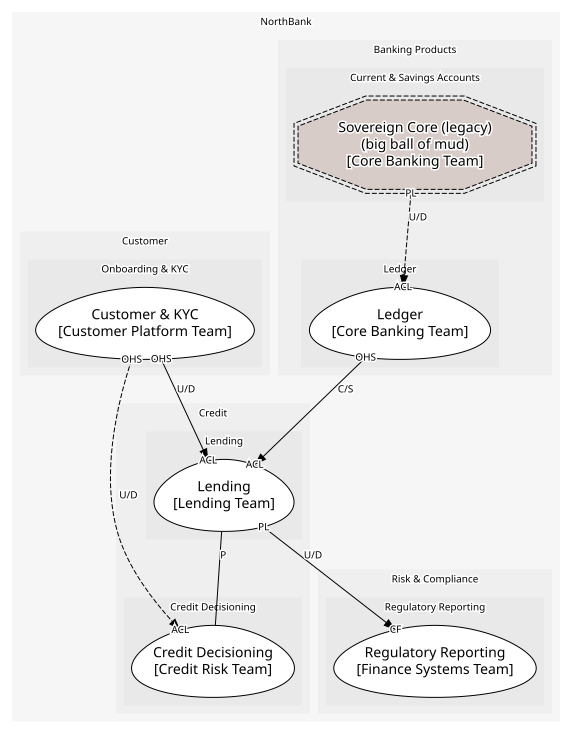
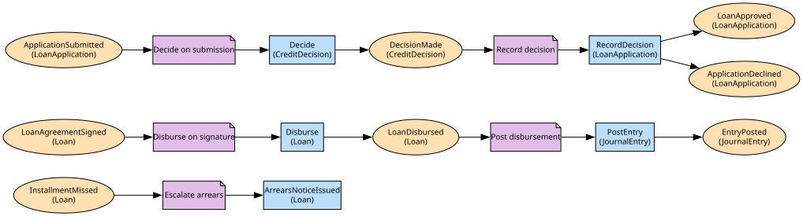

# Lending
Applications, agreements, loans and schedules

**Owned by:** Lending Team

## Serves
- [Credit / Lending](../../domains/credit/subdomains/lending/index.md) (core)

## Glossary
| Term | Definition | Aliases | Embodied by |
| --- | --- | --- | --- |
| **Loan** | Money lent under a signed agreement, repaid by a schedule | - | Loan |
| **Drawdown** | Paying the principal to the customer. The ledger calls it a posting | Disbursement | Disburse |
| **Arrears** | At least one installment missed; the regulatory notice follows (IssueArrearsNotice). Notice intervals and forbearance are servicing detail left out (DISCOVERY section 8) | - | LoanStatus |

## Aggregates

### [LoanApplication](aggregates/loan_application/index.md)
A customer asking for an amount over a term, and the decision on it

### [Loan](aggregates/loan/index.md)
A signed agreement, its schedule and its installments; the schedule is checked against the principal

	
## Services
> No services.

## Schemas
| Name | Description | Attributes | Used by |
| --- | --- | --- | --- |
| ApplicationSubmitted | What decisioning receives | **applicationId**: `string`, customerId: `string`, requested: `Money`, term: `Term` | ApplicationSubmitted, SubmitApplication |
| LoanEvent | Loan, account and amount; shared by the loan events | **loanId**: `string`, accountId: `string`, amount: `Money` | LoanDisbursed, InstallmentMissed, SignAgreement |

## Policies

| Name | Description | On | Then |
| --- | --- | --- | --- |
| Escalate arrears | A missed installment triggers the arrears notice | InstallmentMissed | ArrearsNoticeIssued |
| Disburse on signature | A signed agreement is disbursed | LoanAgreementSigned | Disburse |
| Post disbursement | Disbursement is a ledger entry: debit loan book, credit the account | LoanDisbursed | PostEntry |
| Decide on submission | Every submitted application is sent for a decision | ApplicationSubmitted | Decide |
| Record decision | The outcome and reasons are stored on the application | DecisionMade | RecordDecision |

## Context Relationships
| Upstream | Relationship | Downstream | Upstream Roles | Downstream Roles |
| --- | --- | --- | --- | --- |
| Customer & KYC | upstream-downstream | Lending | open-host-service | anti-corruption-layer |
| Ledger | customer-supplier | Lending | open-host-service | anti-corruption-layer |
| Lending | upstream-downstream | Regulatory Reporting | published-language | conformist |
| Lending | partnership | Credit Decisioning | - | - |
| Customer & KYC | upstream-downstream (implied) | Credit Decisioning | open-host-service | anti-corruption-layer |
| Sovereign Core (legacy) | upstream-downstream (implied) | Ledger | published-language | anti-corruption-layer |

## Consumptions
| Consumer | Consumed As | Provider | Consumable | Provided As |
| --- | --- | --- | --- | --- |
| [LoanApplication](aggregates/loan_application/index.md) | anti-corruption-layer | OnboardingApp | GetCustomer | open-host-service |
| [LoanApplication](aggregates/loan_application/index.md) | conformist | CreditDecision | Decide | open-host-service |
| [CreditDecision](../credit_decisioning/aggregates/credit_decision/index.md) | anti-corruption-layer | OnboardingApp | GetCustomer | open-host-service |
| [LoanApplication](aggregates/loan_application/index.md) | conformist | CreditDecision | DecisionMade | published-language |
| [RegulatoryReturn](../regulatory_reporting/aggregates/regulatory_return/index.md) | conformist | Loan | LoanDisbursed | published-language |
| [Loan](aggregates/loan/index.md) | anti-corruption-layer | JournalEntry | PostEntry | open-host-service |
| [JournalEntry](../ledger/aggregates/journal_entry/index.md) | anti-corruption-layer | SavingsAccountRecord | NightlyBatchCompleted | published-language |

