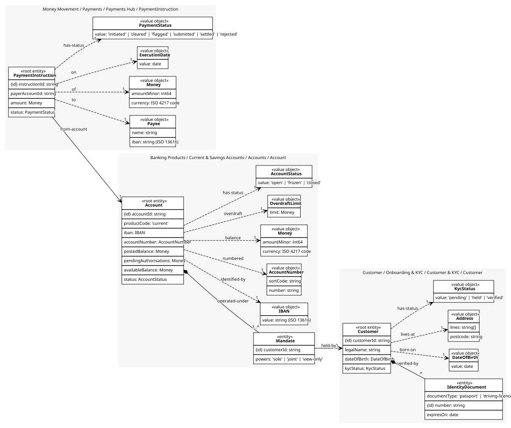
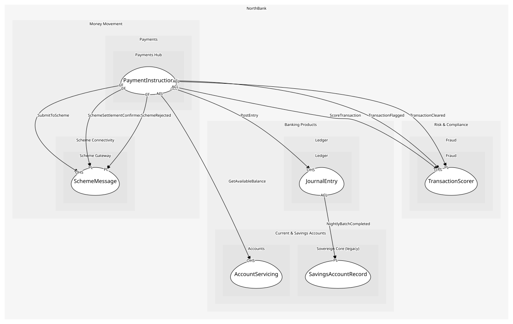

# PaymentInstruction
A customer telling the bank to pay a payee an amount on a date

## Entities and Value Objects
| Type | Name | Description | Attributes |
| --- | --- | --- | --- |
| Entity (Root) | **PaymentInstruction** | One instruction, from initiation to settlement or rejection | **instructionId**: `string`, payerAccountId: `string`, amount: `Money`, status: `PaymentStatus` |
| Value Object | Payee | Name and IBAN of who gets paid; a value because the same details are the same payee | name: `string`, iban: `string (ISO 13616)` |
| Value Object | Money | Minor units and an ISO 4217 code. Never a float; the shared kernel library is the one implementation | amountMinor: `int64`, currency: `ISO 4217 code` |
| Value Object | ExecutionDate | When to send it; today means before the scheme cut-off | value: `date` |
| Value Object | PaymentStatus | initiated, cleared, flagged, submitted, settled, rejected | value: `'initiated' | 'cleared' | 'flagged' | 'submitted' | 'settled' | 'rejected'` |

## Relationships
| Source | Description | Target | Relation | Cardinality |
| --- | --- | --- | --- | --- |
| [PaymentInstruction](entities/payment_instruction/index.md) | to | PaymentInstruction - Payee | uses | 1 |
| [PaymentInstruction](entities/payment_instruction/index.md) | of | PaymentInstruction - Money | uses | 1 |
| [PaymentInstruction](entities/payment_instruction/index.md) | on | PaymentInstruction - ExecutionDate | uses | 1 |
| [PaymentInstruction](entities/payment_instruction/index.md) | has-status | PaymentInstruction - PaymentStatus | uses | 1 |
| [PaymentInstruction](entities/payment_instruction/index.md) | from-account | Account - Account | references | 1 |
| [Account](../../../accounts/aggregates/account/entities/account/index.md) | operated-under | Account - Mandate | includes | 1..* |
| [Mandate](../../../accounts/aggregates/account/entities/mandate/index.md) | held-by | Customer - Customer | references | 1 |
| [Customer](../../../customer_&_kyc/aggregates/customer/entities/customer/index.md) | verified-by | Customer - IdentityDocument | includes | * |
| [Customer](../../../customer_&_kyc/aggregates/customer/entities/customer/index.md) | born-on | Customer - DateOfBirth | uses | 1 |
| [Customer](../../../customer_&_kyc/aggregates/customer/entities/customer/index.md) | lives-at | Customer - Address | uses | 1 |
| [Customer](../../../customer_&_kyc/aggregates/customer/entities/customer/index.md) | has-status | Customer - KycStatus | uses | 1 |
| [Account](../../../accounts/aggregates/account/entities/account/index.md) | identified-by | Account - IBAN | uses | 1 |
| [Account](../../../accounts/aggregates/account/entities/account/index.md) | numbered | Account - AccountNumber | uses | 1 |
| [Account](../../../accounts/aggregates/account/entities/account/index.md) | balance | Account - Money | uses | 1 |
| [Account](../../../accounts/aggregates/account/entities/account/index.md) | overdraft | Account - OverdraftLimit | uses | 1 |
| [Account](../../../accounts/aggregates/account/entities/account/index.md) | has-status | Account - AccountStatus | uses | 1 |

## Invariants
| Name | Description | Constrains |
| --- | --- | --- |
| PayerNotPayee | The payer and payee accounts differ | Payee |
| AmountPositive | The amount is greater than zero | PaymentInstruction.amount |
| DailyLimit | Instructions from one account never exceed the daily limit in total | PaymentInstruction.amount |
| CutOffRespected | A same-day instruction is initiated before the scheme cut-off | ExecutionDate |
| FlaggedNeverSubmitted | A flagged instruction is rejected; it never reaches a scheme | PaymentStatus |

## Provides
| Name | Type | Internal | Pattern | Description | Schema | Raises |
| --- | --- | --- | --- | --- | --- | --- |
| PaymentInitiated | event | no | published-language | A customer asked to pay; fraud scores it next | [PaymentEvent](../../index.md#schemas) | - |
| PaymentSubmitted | event | yes | - | Cleared and ready for the scheme | - | - |
| PaymentSettled | event | no | published-language | The scheme confirmed; the ledger posts | [PaymentEvent](../../index.md#schemas) | - |
| PaymentRejected | event | no | published-language | Flagged or refused by the scheme | [PaymentEvent](../../index.md#schemas) | - |
| InitiatePayment | operation | no | open-host-service | Create an instruction from a channel | [InitiatePayment](../../index.md#schemas) | PaymentInitiated |
| SubmitPayment | operation | yes | - | Mark cleared and hand to the gateway | - | PaymentSubmitted |
| ConfirmSettlement | operation | yes | - | Record the scheme's confirmation | - | PaymentSettled |
| RejectPayment | operation | yes | - | Reject a flagged or scheme-refused instruction | - | PaymentRejected |

## Consumes

### SubmitToScheme [conformist]
Send a submission and await the response
- **Provider**: [SchemeMessage](../../../scheme_gateway/aggregates/scheme_message/index.md)

### SchemeSettlementConfirmed [conformist]
The scheme settled the payment
- **Provider**: [SchemeMessage](../../../scheme_gateway/aggregates/scheme_message/index.md)

### SchemeRejected [conformist]
The scheme refused the message
- **Provider**: [SchemeMessage](../../../scheme_gateway/aggregates/scheme_message/index.md)

### PostEntry [anti-corruption-layer]
Post a balanced entry
- **Provider**: [JournalEntry](../../../ledger/aggregates/journal_entry/index.md)

### ScoreTransaction [anti-corruption-layer]
Score synchronously; callers wait on the verdict
- **Provider**: [TransactionScorer](../../../fraud/services/transaction_scorer/index.md)

### TransactionFlagged [anti-corruption-layer]
Above threshold; the caller stops the transaction
- **Provider**: [FraudCase](../../../fraud/aggregates/fraud_case/index.md)

### TransactionCleared [anti-corruption-layer]
Below threshold; the caller proceeds
- **Provider**: [FraudCase](../../../fraud/aggregates/fraud_case/index.md)

	
