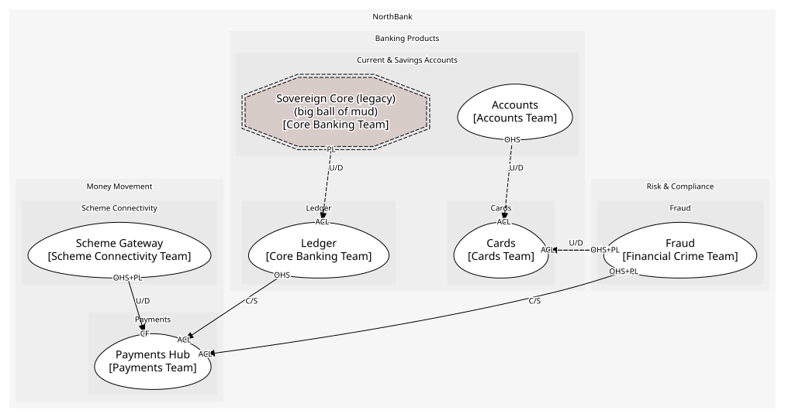
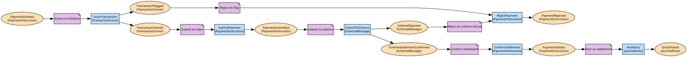

# Payments Hub
Instructions scored, submitted, settled and posted

**Owned by:** Payments Team

## Serves
- [Money Movement / Payments](../../domains/money_movement/subdomains/payments/index.md) (supporting)

## Glossary
| Term | Definition | Aliases | Embodied by |
| --- | --- | --- | --- |
| **Instruction** | A customer's request to pay. Cards say payment and mean a card transaction; branches say transfer | Payment, Transfer | PaymentInstruction |
| **Payee** | Who gets paid: a name and an IBAN | Beneficiary | Payee |
| **Settlement** | The scheme's confirmation that the money moved | - | PaymentSettled |

## Aggregates

### [PaymentInstruction](aggregates/payment_instruction/index.md)
A customer telling the bank to pay a payee an amount on a date

	
## Services
> No services.

## Schemas
| Name | Description | Attributes | Used by |
| --- | --- | --- | --- |
| InitiatePayment | - | payerAccountId: `string`, payee: `Payee`, amount: `Money`, executionDate: `ExecutionDate` | InitiatePayment |
| PaymentEvent | Instruction id, amount and payee; shared by the payment events | **instructionId**: `string`, payerAccountId: `string`, amount: `Money`, payee: `Payee` | PaymentInitiated, PaymentSettled, PaymentRejected |

## Policies

| Name | Description | On | Then |
| --- | --- | --- | --- |
| Submit to scheme | A submitted instruction goes to the gateway | PaymentSubmitted | SubmitToScheme |
| Confirm settlement | The scheme's confirmation settles the instruction | SchemeSettlementConfirmed | ConfirmSettlement |
| Reject on scheme refusal | A refused message rejects the instruction | SchemeRejected | RejectPayment |
| Post on settlement | A settled instruction posts to the ledger | PaymentSettled | PostEntry |
| Score on initiation | Every instruction is scored before it goes anywhere | PaymentInitiated | ScoreTransaction |
| Submit on clear | A cleared instruction is submitted | TransactionCleared | SubmitPayment |
| Reject on flag | A flagged instruction is rejected, never submitted | TransactionFlagged | RejectPayment |

## Context Relationships
| Upstream | Relationship | Downstream | Upstream Roles | Downstream Roles |
| --- | --- | --- | --- | --- |
| Ledger | customer-supplier | Payments Hub | open-host-service | anti-corruption-layer |
| Fraud | customer-supplier | Payments Hub | open-host-service, published-language | anti-corruption-layer |
| Scheme Gateway | upstream-downstream | Payments Hub | open-host-service, published-language | conformist |
| Sovereign Core (legacy) | upstream-downstream (implied) | Ledger | published-language | anti-corruption-layer |
| Cards | upstream-downstream (implied) | Fraud | published-language | anti-corruption-layer |
| Accounts | upstream-downstream (implied) | Cards | open-host-service | anti-corruption-layer |
| Fraud | upstream-downstream (implied) | Cards | open-host-service, published-language | anti-corruption-layer |

## Consumptions
| Consumer | Consumed As | Provider | Consumable | Provided As |
| --- | --- | --- | --- | --- |
| [PaymentInstruction](aggregates/payment_instruction/index.md) | conformist | SchemeMessage | SubmitToScheme | open-host-service |
| [PaymentInstruction](aggregates/payment_instruction/index.md) | conformist | SchemeMessage | SchemeSettlementConfirmed | published-language |
| [PaymentInstruction](aggregates/payment_instruction/index.md) | conformist | SchemeMessage | SchemeRejected | published-language |
| [PaymentInstruction](aggregates/payment_instruction/index.md) | anti-corruption-layer | JournalEntry | PostEntry | open-host-service |
| [JournalEntry](../ledger/aggregates/journal_entry/index.md) | anti-corruption-layer | SavingsAccountRecord | NightlyBatchCompleted | published-language |
| [PaymentInstruction](aggregates/payment_instruction/index.md) | anti-corruption-layer | TransactionScorer | ScoreTransaction | open-host-service |
| [PaymentInstruction](aggregates/payment_instruction/index.md) | anti-corruption-layer | FraudCase | TransactionFlagged | published-language |
| [FraudCase](../fraud/aggregates/fraud_case/index.md) | anti-corruption-layer | Card | CardAuthorised | published-language |
| [Card](../cards/aggregates/card/index.md) | anti-corruption-layer | AccountServicing | GetAvailableBalance | open-host-service |
| [Card](../cards/aggregates/card/index.md) | anti-corruption-layer | TransactionScorer | ScoreTransaction | open-host-service |
| [Card](../cards/aggregates/card/index.md) | anti-corruption-layer | FraudCase | TransactionFlagged | published-language |
| [PaymentInstruction](aggregates/payment_instruction/index.md) | anti-corruption-layer | FraudCase | TransactionCleared | published-language |

