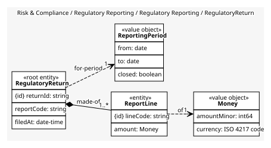
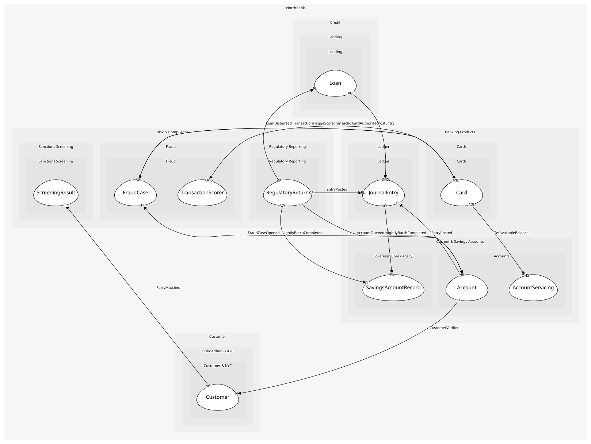

# RegulatoryReturn
One report code for one period and its lines

## Entities and Value Objects
| Type | Name | Description | Attributes |
| --- | --- | --- | --- |
| Entity (Root) | **RegulatoryReturn** | A return to the PCA | **returnId**: `string`, reportCode: `string`, filedAt: `date-time` |
| Entity | ReportLine | One line code and its amount | **lineCode**: `string`, amount: `Money` |
| Value Object | ReportingPeriod | Month or quarter; closed before filing | from: `date`, to: `date`, closed: `boolean` |
| Value Object | Money | Minor units and an ISO 4217 code. Never a float; the shared kernel library is the one implementation | amountMinor: `int64`, currency: `ISO 4217 code` |

## Relationships
| Source | Description | Target | Relation | Cardinality |
| --- | --- | --- | --- | --- |
| [RegulatoryReturn](entities/regulatory_return/index.md) | made-of | RegulatoryReturn - ReportLine | includes | 1..* |
| [ReportLine](entities/report_line/index.md) | of | RegulatoryReturn - Money | uses | 1 |
| [RegulatoryReturn](entities/regulatory_return/index.md) | for-period | RegulatoryReturn - ReportingPeriod | uses | 1 |

## Invariants
| Name | Description | Constrains |
| --- | --- | --- |
| LinesReconcileToLedger | Every line reconciles to ledger postings for the period | ReportLine |
| PeriodClosedBeforeFiling | A return is filed only for a closed period | ReportingPeriod |
| FiledOnceOnly | A return is filed once; corrections are a new return | RegulatoryReturn |

## Provides
| Name | Type | Internal | Pattern | Description | Schema | Raises |
| --- | --- | --- | --- | --- | --- | --- |
| ReturnFiled | event | yes | - | Sent to the regulator | - | - |
| AccumulateLine | operation | yes | - | Add an event's amount to the right line | - | - |
| FileReturn | operation | yes | - | File a closed period's return | - | ReturnFiled |

## Consumes

### EntryPosted [conformist]
Money moved; balances and reports follow
- **Provider**: [JournalEntry](../../../ledger/aggregates/journal_entry/index.md)

### AccountOpened [conformist]
A product exists for a verified customer
- **Provider**: [Account](../../../accounts/aggregates/account/index.md)

### LoanDisbursed [conformist]
The principal reached the account; the ledger posts and reporting counts it
- **Provider**: [Loan](../../../lending/aggregates/loan/index.md)

### NightlyBatchCompleted [anti-corruption-layer]
The day's savings movements are in the batch file
- **Provider**: [SavingsAccountRecord](../../../sovereign_core_(legacy)/aggregates/savings_account_record/index.md)

	
