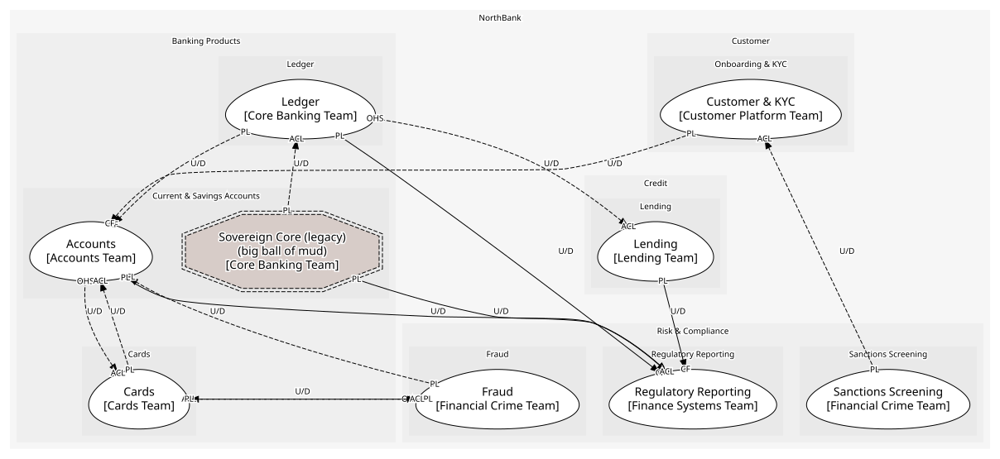
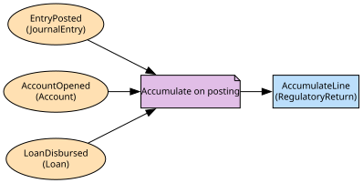

# Regulatory Reporting
Returns assembled from events and reconciled to the ledger

**Owned by:** Finance Systems Team

## Serves
- [Risk & Compliance / Regulatory Reporting](../../domains/risk_&_compliance/subdomains/regulatory_reporting/index.md) (supporting)

## Glossary
| Term | Definition | Aliases | Embodied by |
| --- | --- | --- | --- |
| **Return** | A report to the regulator. The branches' 'return' is a returned payment | - | RegulatoryReturn |
| **Reporting period** | The month or quarter a return covers | - | ReportingPeriod |

## Aggregates

### [RegulatoryReturn](aggregates/regulatory_return/index.md)
One report code for one period and its lines

	
## Services
> No services.

## Schemas
> No schemas.

## Policies

| Name | Description | On | Then |
| --- | --- | --- | --- |
| Accumulate on posting | Ledger postings, account openings and disbursements each add to a line as they happen | EntryPosted, AccountOpened, LoanDisbursed | AccumulateLine |

## Context Relationships
| Upstream | Relationship | Downstream | Upstream Roles | Downstream Roles |
| --- | --- | --- | --- | --- |
| Ledger | upstream-downstream | Regulatory Reporting | published-language | conformist |
| Accounts | upstream-downstream | Regulatory Reporting | published-language | conformist |
| Lending | upstream-downstream | Regulatory Reporting | published-language | conformist |
| Sovereign Core (legacy) | upstream-downstream | Regulatory Reporting | published-language | anti-corruption-layer |
| Sovereign Core (legacy) | upstream-downstream (implied) | Ledger | published-language | anti-corruption-layer |
| Customer & KYC | upstream-downstream (implied) | Accounts | published-language | conformist |
| Sanctions Screening | upstream-downstream (implied) | Customer & KYC | published-language | anti-corruption-layer |
| Ledger | upstream-downstream (implied) | Accounts | published-language | conformist |
| Fraud | upstream-downstream (implied) | Accounts | published-language | anti-corruption-layer |
| Cards | upstream-downstream (implied) | Fraud | published-language | anti-corruption-layer |
| Accounts | upstream-downstream (implied) | Cards | open-host-service | anti-corruption-layer |
| Fraud | upstream-downstream (implied) | Cards | open-host-service, published-language | anti-corruption-layer |
| Ledger | upstream-downstream (implied) | Lending | open-host-service | anti-corruption-layer |

## Consumptions
| Consumer | Consumed As | Provider | Consumable | Provided As |
| --- | --- | --- | --- | --- |
| [RegulatoryReturn](aggregates/regulatory_return/index.md) | conformist | JournalEntry | EntryPosted | published-language |
| [JournalEntry](../ledger/aggregates/journal_entry/index.md) | anti-corruption-layer | SavingsAccountRecord | NightlyBatchCompleted | published-language |
| [RegulatoryReturn](aggregates/regulatory_return/index.md) | conformist | Account | AccountOpened | published-language |
| [Account](../accounts/aggregates/account/index.md) | conformist | Customer | CustomerVerified | published-language |
| [Customer](../customer_&_kyc/aggregates/customer/index.md) | anti-corruption-layer | ScreeningResult | PartyMatched | published-language |
| [Account](../accounts/aggregates/account/index.md) | conformist | JournalEntry | EntryPosted | published-language |
| [Account](../accounts/aggregates/account/index.md) | anti-corruption-layer | FraudCase | FraudCaseOpened | published-language |
| [FraudCase](../fraud/aggregates/fraud_case/index.md) | anti-corruption-layer | Card | CardAuthorised | published-language |
| [Card](../cards/aggregates/card/index.md) | anti-corruption-layer | AccountServicing | GetAvailableBalance | open-host-service |
| [Card](../cards/aggregates/card/index.md) | anti-corruption-layer | TransactionScorer | ScoreTransaction | open-host-service |
| [Card](../cards/aggregates/card/index.md) | anti-corruption-layer | FraudCase | TransactionFlagged | published-language |
| [RegulatoryReturn](aggregates/regulatory_return/index.md) | conformist | Loan | LoanDisbursed | published-language |
| [Loan](../lending/aggregates/loan/index.md) | anti-corruption-layer | JournalEntry | PostEntry | open-host-service |
| [RegulatoryReturn](aggregates/regulatory_return/index.md) | anti-corruption-layer | SavingsAccountRecord | NightlyBatchCompleted | published-language |

