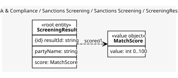
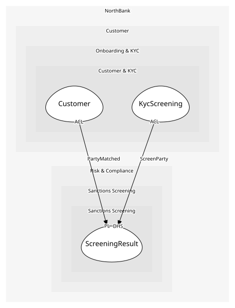

# ScreeningResult
One name checked against the lists

## Entities and Value Objects
| Type | Name | Description | Attributes |
| --- | --- | --- | --- |
| Entity (Root) | **ScreeningResult** | The outcome for one party | **resultId**: `string`, partyName: `string`, score: `MatchScore` |
| Value Object | MatchScore | 0 to 100; above the threshold is a match | value: `int 0..100` |

## Relationships
| Source | Description | Target | Relation | Cardinality |
| --- | --- | --- | --- | --- |
| [ScreeningResult](entities/screening_result/index.md) | scored | ScreeningResult - MatchScore | uses | 1 |

## Invariants
> No invariants.

## Provides
| Name | Type | Internal | Pattern | Description | Schema | Raises |
| --- | --- | --- | --- | --- | --- | --- |
| PartyMatched | event | no | published-language | The name matched a list; the caller stops | [PartyMatched](../../index.md#schemas) | - |
| ScreenParty | operation | no | open-host-service | Check a name, date of birth and country against the lists | [ScreenParty](../../index.md#schemas) | PartyMatched |

## Consumes
> No consumptions.
	
