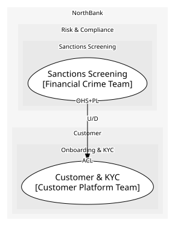

# Sanctions Screening
Names against lists, with a match score

**Owned by:** Financial Crime Team

## Serves
- [Risk & Compliance / Sanctions Screening](../../domains/risk_&_compliance/subdomains/sanctions_screening/index.md) (generic)

## Glossary
> No glossary terms.

## Aggregates

### [ScreeningResult](aggregates/screening_result/index.md)
One name checked against the lists

	
## Services
> No services.

## Schemas
| Name | Description | Attributes | Used by |
| --- | --- | --- | --- |
| ScreenParty | - | name: `string`, dateOfBirth: `date`, country: `ISO 3166 code` | ScreenParty |
| PartyMatched | - | **resultId**: `string`, score: `MatchScore` | PartyMatched |

## Policies
> No policies.

## Context Relationships
| Upstream | Relationship | Downstream | Upstream Roles | Downstream Roles |
| --- | --- | --- | --- | --- |
| Sanctions Screening | upstream-downstream | Customer & KYC | open-host-service, published-language | anti-corruption-layer |

## Consumptions
| Consumer | Consumed As | Provider | Consumable | Provided As |
| --- | --- | --- | --- | --- |
| [Customer](../customer_&_kyc/aggregates/customer/index.md) | anti-corruption-layer | ScreeningResult | PartyMatched | published-language |
| [KycScreening](../customer_&_kyc/services/kyc_screening/index.md) | anti-corruption-layer | ScreeningResult | ScreenParty | open-host-service |

