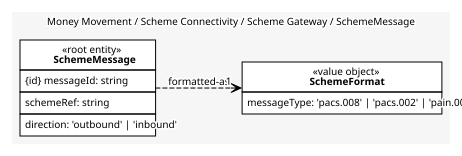
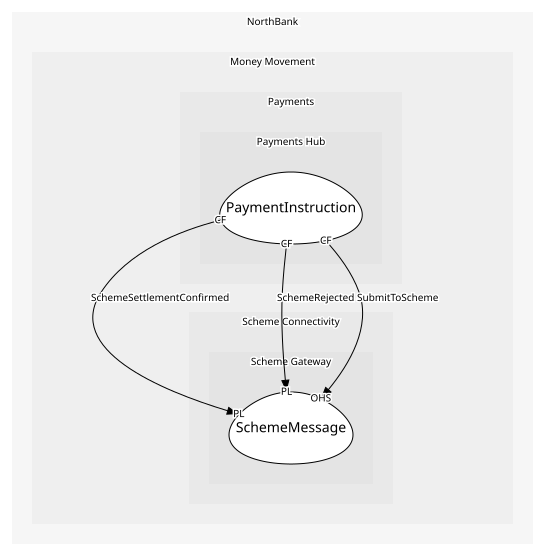

# SchemeMessage
One message to or from a scheme

## Entities and Value Objects
| Type | Name | Description | Attributes |
| --- | --- | --- | --- |
| Entity (Root) | **SchemeMessage** | A submission or a response | **messageId**: `string`, schemeRef: `string`, direction: `'outbound' | 'inbound'` |
| Value Object | SchemeFormat | The ISO 20022 message type | messageType: `'pacs.008' | 'pacs.002' | 'pain.001'` |

## Relationships
| Source | Description | Target | Relation | Cardinality |
| --- | --- | --- | --- | --- |
| [SchemeMessage](entities/scheme_message/index.md) | formatted-as | SchemeMessage - SchemeFormat | uses | 1 |

## Invariants
> No invariants.

## Provides
| Name | Type | Internal | Pattern | Description | Schema | Raises |
| --- | --- | --- | --- | --- | --- | --- |
| SchemeSettlementConfirmed | event | no | published-language | The scheme settled the payment | [SchemeSettlement](../../index.md#schemas) | - |
| SchemeRejected | event | no | published-language | The scheme refused the message | [SchemeSettlement](../../index.md#schemas) | - |
| SubmitToScheme | operation | no | open-host-service | Send a submission and await the response | [SchemeSubmission](../../index.md#schemas) | SchemeSettlementConfirmed, SchemeRejected |

## Consumes
> No consumptions.
	
