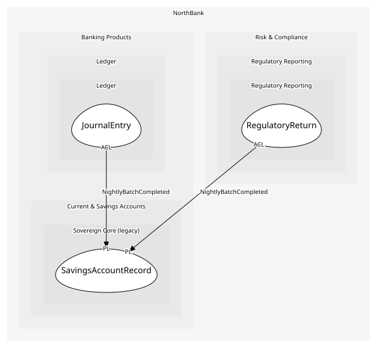

# SavingsAccountRecord
The mainframe's savings account row, as far as anyone can read it

## Entities and Value Objects
| Type | Name | Description | Attributes |
| --- | --- | --- | --- |
| Entity (Root) | **SavingsAccountRecord** | One savings account on Sovereign | **accountNo**: `string`, productCode: `string` |

## Relationships

## Invariants
> No invariants.

## Provides
| Name | Type | Internal | Pattern | Description | Schema | Raises |
| --- | --- | --- | --- | --- | --- | --- |
| NightlyBatchCompleted | event | no | published-language | The day's savings movements are in the batch file | [NightlyBatchCompleted](../../index.md#schemas) | - |

## Consumes
> No consumptions.
	
