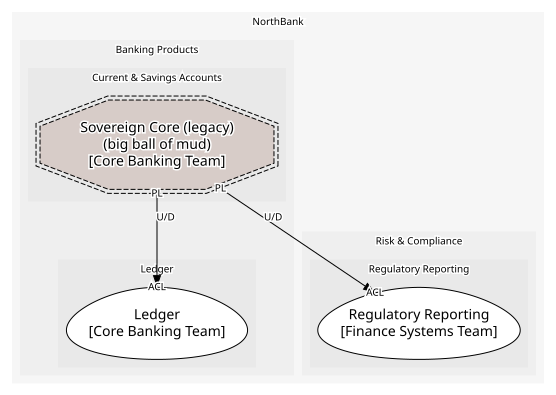

# Sovereign Core (legacy)
> ⚠️ **Big ball of mud.** This context's model is not coherent; neighbours should protect themselves with an anti-corruption layer.

The 1989 COBOL core that still holds savings accounts and runs the nightly batch. Modelled at its edge only

**Owned by:** Core Banking Team

## Serves
- [Banking Products / Current & Savings Accounts](../../domains/banking_products/subdomains/current_&_savings_accounts/index.md) (core)

## Glossary
> No glossary terms.

## Aggregates

### [SavingsAccountRecord](aggregates/savings_account_record/index.md)
The mainframe's savings account row, as far as anyone can read it

	
## Services
> No services.

## Schemas
| Name | Description | Attributes | Used by |
| --- | --- | --- | --- |
| NightlyBatchCompleted | The batch file's header: date and the postings file location | **batchDate**: `date`, postingsFile: `string` | NightlyBatchCompleted |

## Policies
> No policies.

## Context Relationships
| Upstream | Relationship | Downstream | Upstream Roles | Downstream Roles |
| --- | --- | --- | --- | --- |
| Sovereign Core (legacy) | upstream-downstream | Ledger | published-language | anti-corruption-layer |
| Sovereign Core (legacy) | upstream-downstream | Regulatory Reporting | published-language | anti-corruption-layer |

## Consumptions
| Consumer | Consumed As | Provider | Consumable | Provided As |
| --- | --- | --- | --- | --- |
| [JournalEntry](../ledger/aggregates/journal_entry/index.md) | anti-corruption-layer | SavingsAccountRecord | NightlyBatchCompleted | published-language |
| [RegulatoryReturn](../regulatory_reporting/aggregates/regulatory_return/index.md) | anti-corruption-layer | SavingsAccountRecord | NightlyBatchCompleted | published-language |

