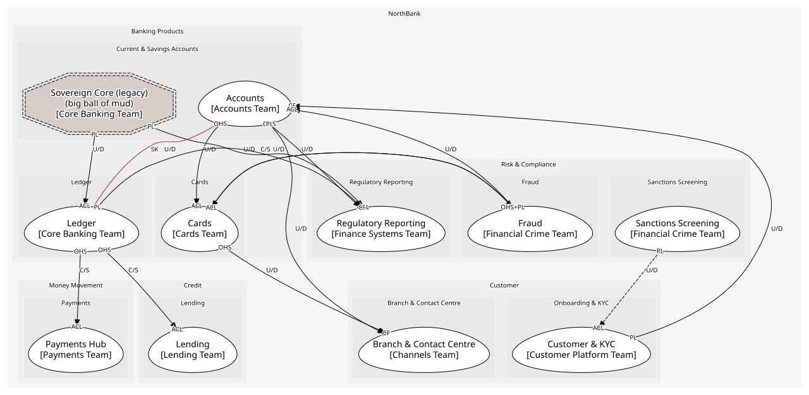

# Banking Products
Accounts, the ledger beneath them, and cards

## Subdomains

### [Current & Savings Accounts](subdomains/current_&_savings_accounts/index.md) (core)
The account is the relationship; where the Fair Treatment Rules bite

### [Ledger](subdomains/ledger/index.md) (supporting)
Double-entry postings. Must be perfect; not unique

### [Cards](subdomains/cards/index.md) (generic)
Issuing and authorisation. "We would outsource it if the contract allowed"

## Context Relationships
| Upstream | Relationship | Downstream | Upstream Roles | Downstream Roles |
| --- | --- | --- | --- | --- |
| Customer & KYC | upstream-downstream | Accounts | published-language | conformist |
| Ledger | customer-supplier | Payments Hub | open-host-service | anti-corruption-layer |
| Ledger | customer-supplier | Lending | open-host-service | anti-corruption-layer |
| Fraud | customer-supplier | Cards | open-host-service, published-language | anti-corruption-layer |
| Cards | upstream-downstream | Fraud | published-language | anti-corruption-layer |
| Fraud | upstream-downstream | Accounts | published-language | anti-corruption-layer |
| Accounts | upstream-downstream | Cards | open-host-service | anti-corruption-layer |
| Accounts | upstream-downstream | Branch & Contact Centre | open-host-service | conformist |
| Cards | upstream-downstream | Branch & Contact Centre | open-host-service | conformist |
| Ledger | upstream-downstream | Regulatory Reporting | published-language | conformist |
| Accounts | upstream-downstream | Regulatory Reporting | published-language | conformist |
| Sovereign Core (legacy) | upstream-downstream | Ledger | published-language | anti-corruption-layer |
| Sovereign Core (legacy) | upstream-downstream | Regulatory Reporting | published-language | anti-corruption-layer |
| Accounts | shared-kernel | Ledger | - | - |
| Sanctions Screening | upstream-downstream (implied) | Customer & KYC | published-language | anti-corruption-layer |

## Consumptions
| Consumer | Consumed As | Provider | Consumable | Provided As |
| --- | --- | --- | --- | --- |
| [Card](../../boundedcontexts/cards/aggregates/card/index.md) | anti-corruption-layer | AccountServicing | GetAvailableBalance | open-host-service |
| [ServiceRequest](../../boundedcontexts/branch_&_contact_centre/aggregates/service_request/index.md) | conformist | AccountServicing | GetAvailableBalance | open-host-service |
| [RegulatoryReturn](../../boundedcontexts/regulatory_reporting/aggregates/regulatory_return/index.md) | conformist | Account | AccountOpened | published-language |
| [Account](../../boundedcontexts/accounts/aggregates/account/index.md) | conformist | Customer | CustomerVerified | published-language |
| [Customer](../../boundedcontexts/customer_&_kyc/aggregates/customer/index.md) | anti-corruption-layer | ScreeningResult | PartyMatched | published-language |
| [Account](../../boundedcontexts/accounts/aggregates/account/index.md) | conformist | JournalEntry | EntryPosted | published-language |
| [RegulatoryReturn](../../boundedcontexts/regulatory_reporting/aggregates/regulatory_return/index.md) | conformist | JournalEntry | EntryPosted | published-language |
| [PaymentInstruction](../../boundedcontexts/payments_hub/aggregates/payment_instruction/index.md) | anti-corruption-layer | JournalEntry | PostEntry | open-host-service |
| [Loan](../../boundedcontexts/lending/aggregates/loan/index.md) | anti-corruption-layer | JournalEntry | PostEntry | open-host-service |
| [JournalEntry](../../boundedcontexts/ledger/aggregates/journal_entry/index.md) | anti-corruption-layer | SavingsAccountRecord | NightlyBatchCompleted | published-language |
| [RegulatoryReturn](../../boundedcontexts/regulatory_reporting/aggregates/regulatory_return/index.md) | anti-corruption-layer | SavingsAccountRecord | NightlyBatchCompleted | published-language |
| [Account](../../boundedcontexts/accounts/aggregates/account/index.md) | anti-corruption-layer | FraudCase | FraudCaseOpened | published-language |
| [FraudCase](../../boundedcontexts/fraud/aggregates/fraud_case/index.md) | anti-corruption-layer | Card | CardAuthorised | published-language |
| [ServiceRequest](../../boundedcontexts/branch_&_contact_centre/aggregates/service_request/index.md) | conformist | Card | BlockCard | open-host-service |
| [Card](../../boundedcontexts/cards/aggregates/card/index.md) | anti-corruption-layer | TransactionScorer | ScoreTransaction | open-host-service |
| [Card](../../boundedcontexts/cards/aggregates/card/index.md) | anti-corruption-layer | FraudCase | TransactionFlagged | published-language |

	
