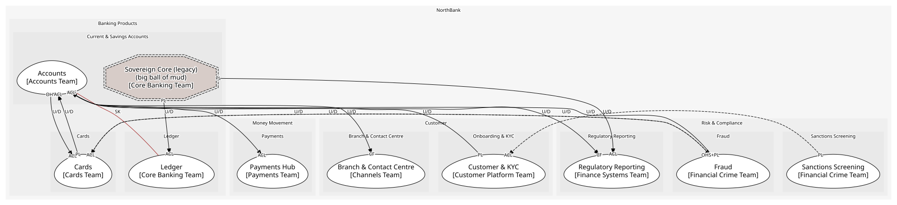

# Current & Savings Accounts (core)
The account is the relationship; where the Fair Treatment Rules bite

## Bounded Contexts

### [Accounts](../../../../boundedcontexts/accounts/index.md)
Current accounts on the 2019 platform: mandates, overdrafts, holds, status. Savings remain on Sovereign

### [Sovereign Core (legacy)](../../../../boundedcontexts/sovereign_core_(legacy)/index.md)
The 1989 COBOL core that still holds savings accounts and runs the nightly batch. Modelled at its edge only

## Context Relationships
| Upstream | Relationship | Downstream | Upstream Roles | Downstream Roles |
| --- | --- | --- | --- | --- |
| Customer & KYC | upstream-downstream | Accounts | published-language | conformist |
| Fraud | upstream-downstream | Accounts | published-language | anti-corruption-layer |
| Accounts | upstream-downstream | Cards | open-host-service | anti-corruption-layer |
| Cards | upstream-downstream | Accounts | published-language | anti-corruption-layer |
| Accounts | upstream-downstream | Payments Hub | open-host-service | anti-corruption-layer |
| Accounts | upstream-downstream | Branch & Contact Centre | open-host-service | conformist |
| Accounts | upstream-downstream | Regulatory Reporting | published-language | conformist |
| Sovereign Core (legacy) | upstream-downstream | Ledger | published-language | anti-corruption-layer |
| Sovereign Core (legacy) | upstream-downstream | Regulatory Reporting | published-language | anti-corruption-layer |
| Accounts | shared-kernel | Ledger | - | - |
| Sanctions Screening | upstream-downstream (implied) | Customer & KYC | published-language | anti-corruption-layer |
| Cards | upstream-downstream (implied) | Fraud | published-language | anti-corruption-layer |
| Fraud | upstream-downstream (implied) | Cards | open-host-service, published-language | anti-corruption-layer |

## Consumptions
| Consumer | Consumed As | Provider | Consumable | Provided As |
| --- | --- | --- | --- | --- |
| [PaymentInstruction](../../../../boundedcontexts/payments_hub/aggregates/payment_instruction/index.md) | anti-corruption-layer | AccountServicing | GetAvailableBalance | open-host-service |
| [Card](../../../../boundedcontexts/cards/aggregates/card/index.md) | anti-corruption-layer | AccountServicing | GetAvailableBalance | open-host-service |
| [ServiceRequest](../../../../boundedcontexts/branch_&_contact_centre/aggregates/service_request/index.md) | conformist | AccountServicing | GetAvailableBalance | open-host-service |
| [RegulatoryReturn](../../../../boundedcontexts/regulatory_reporting/aggregates/regulatory_return/index.md) | conformist | Account | AccountOpened | published-language |
| [Account](../../../../boundedcontexts/accounts/aggregates/account/index.md) | conformist | Customer | CustomerVerified | published-language |
| [Customer](../../../../boundedcontexts/customer_&_kyc/aggregates/customer/index.md) | anti-corruption-layer | ScreeningResult | PartyMatched | published-language |
| [Account](../../../../boundedcontexts/accounts/aggregates/account/index.md) | conformist | JournalEntry | EntryPosted | published-language |
| [JournalEntry](../../../../boundedcontexts/ledger/aggregates/journal_entry/index.md) | anti-corruption-layer | SavingsAccountRecord | NightlyBatchCompleted | published-language |
| [RegulatoryReturn](../../../../boundedcontexts/regulatory_reporting/aggregates/regulatory_return/index.md) | anti-corruption-layer | SavingsAccountRecord | NightlyBatchCompleted | published-language |
| [Account](../../../../boundedcontexts/accounts/aggregates/account/index.md) | anti-corruption-layer | FraudCase | FraudCaseOpened | published-language |
| [FraudCase](../../../../boundedcontexts/fraud/aggregates/fraud_case/index.md) | anti-corruption-layer | Card | CardAuthorised | published-language |
| [Card](../../../../boundedcontexts/cards/aggregates/card/index.md) | anti-corruption-layer | TransactionScorer | ScoreTransaction | open-host-service |
| [Card](../../../../boundedcontexts/cards/aggregates/card/index.md) | anti-corruption-layer | TransactionScorer | TransactionFlagged | published-language |
| [Account](../../../../boundedcontexts/accounts/aggregates/account/index.md) | anti-corruption-layer | Card | CardAuthorised | published-language |
	
	
