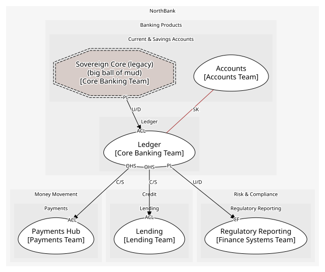

# Ledger (supporting)
Double-entry postings. Must be perfect; not unique

## Bounded Contexts

### [Ledger](../../../../boundedcontexts/ledger/index.md)
Balanced, immutable journal entries

## Context Relationships
| Upstream | Relationship | Downstream | Upstream Roles | Downstream Roles |
| --- | --- | --- | --- | --- |
| Ledger | customer-supplier | Payments Hub | open-host-service | anti-corruption-layer |
| Ledger | customer-supplier | Lending | open-host-service | anti-corruption-layer |
| Ledger | upstream-downstream | Regulatory Reporting | published-language | conformist |
| Sovereign Core (legacy) | upstream-downstream | Ledger | published-language | anti-corruption-layer |
| Accounts | shared-kernel | Ledger | - | - |

## Consumptions
| Consumer | Consumed As | Provider | Consumable | Provided As |
| --- | --- | --- | --- | --- |
| [Account](../../../../boundedcontexts/accounts/aggregates/account/index.md) | conformist | JournalEntry | EntryPosted | published-language |
| [RegulatoryReturn](../../../../boundedcontexts/regulatory_reporting/aggregates/regulatory_return/index.md) | conformist | JournalEntry | EntryPosted | published-language |
| [PaymentInstruction](../../../../boundedcontexts/payments_hub/aggregates/payment_instruction/index.md) | anti-corruption-layer | JournalEntry | PostEntry | open-host-service |
| [Loan](../../../../boundedcontexts/lending/aggregates/loan/index.md) | anti-corruption-layer | JournalEntry | PostEntry | open-host-service |
| [JournalEntry](../../../../boundedcontexts/ledger/aggregates/journal_entry/index.md) | anti-corruption-layer | SavingsAccountRecord | NightlyBatchCompleted | published-language |
	
	
