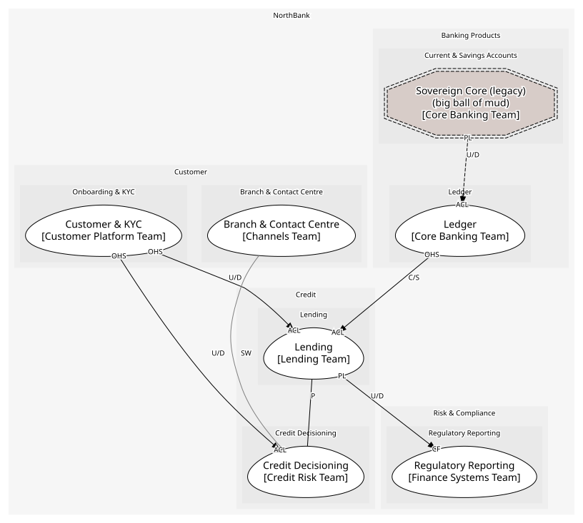

# Credit
Lending the bank's money well

## Subdomains

### [Lending](subdomains/lending/index.md) (core)
Origination and servicing. A below-market loss rate for fifteen years

### [Credit Decisioning](subdomains/credit_decisioning/index.md) (core)
The bank's own scorecard and affordability rules

## Context Relationships
| Upstream | Relationship | Downstream | Upstream Roles | Downstream Roles |
| --- | --- | --- | --- | --- |
| Customer & KYC | upstream-downstream | Lending | open-host-service | anti-corruption-layer |
| Customer & KYC | upstream-downstream | Credit Decisioning | open-host-service | anti-corruption-layer |
| Ledger | customer-supplier | Lending | open-host-service | anti-corruption-layer |
| Lending | upstream-downstream | Regulatory Reporting | published-language | conformist |
| Lending | partnership | Credit Decisioning | - | - |
| Branch & Contact Centre | separate-ways | Credit Decisioning | - | - |
| Sovereign Core (legacy) | upstream-downstream (implied) | Ledger | published-language | anti-corruption-layer |

## Consumptions
| Consumer | Consumed As | Provider | Consumable | Provided As |
| --- | --- | --- | --- | --- |
| [LoanApplication](../../boundedcontexts/lending/aggregates/loan_application/index.md) | anti-corruption-layer | OnboardingApp | GetCustomer | open-host-service |
| [LoanApplication](../../boundedcontexts/lending/aggregates/loan_application/index.md) | conformist | CreditDecision | Decide | open-host-service |
| [ServiceRequest](../../boundedcontexts/branch_&_contact_centre/aggregates/service_request/index.md) | anti-corruption-layer | CreditDecision | Decide | open-host-service |
| [LoanApplication](../../boundedcontexts/lending/aggregates/loan_application/index.md) | conformist | CreditDecision | DecisionMade | published-language |
| [CreditDecision](../../boundedcontexts/credit_decisioning/aggregates/credit_decision/index.md) | anti-corruption-layer | OnboardingApp | GetCustomer | open-host-service |
| [RegulatoryReturn](../../boundedcontexts/regulatory_reporting/aggregates/regulatory_return/index.md) | conformist | Loan | LoanDisbursed | published-language |
| [Loan](../../boundedcontexts/lending/aggregates/loan/index.md) | anti-corruption-layer | JournalEntry | PostEntry | open-host-service |
| [JournalEntry](../../boundedcontexts/ledger/aggregates/journal_entry/index.md) | anti-corruption-layer | SavingsAccountRecord | NightlyBatchCompleted | published-language |

	
