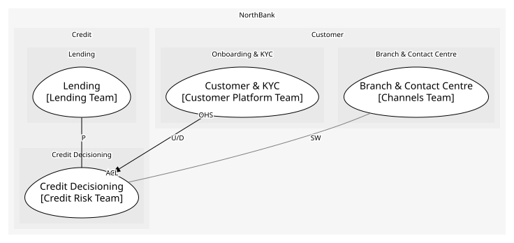

# Credit Decisioning (core)
The bank's own scorecard and affordability rules

## Bounded Contexts

### [Credit Decisioning](../../../../boundedcontexts/credit_decisioning/index.md)
Bureau data, the scorecard and affordability

## Context Relationships
| Upstream | Relationship | Downstream | Upstream Roles | Downstream Roles |
| --- | --- | --- | --- | --- |
| Customer & KYC | upstream-downstream | Credit Decisioning | open-host-service | anti-corruption-layer |
| Lending | partnership | Credit Decisioning | - | - |
| Branch & Contact Centre | separate-ways | Credit Decisioning | - | - |

## Consumptions
| Consumer | Consumed As | Provider | Consumable | Provided As |
| --- | --- | --- | --- | --- |
| [LoanApplication](../../../../boundedcontexts/lending/aggregates/loan_application/index.md) | conformist | CreditDecision | DecisionMade | published-language |
| [LoanApplication](../../../../boundedcontexts/lending/aggregates/loan_application/index.md) | conformist | CreditDecision | Decide | open-host-service |
| [ServiceRequest](../../../../boundedcontexts/branch_&_contact_centre/aggregates/service_request/index.md) | anti-corruption-layer | CreditDecision | Decide | open-host-service |
| [CreditDecision](../../../../boundedcontexts/credit_decisioning/aggregates/credit_decision/index.md) | anti-corruption-layer | OnboardingApp | GetCustomer | open-host-service |
	
	
