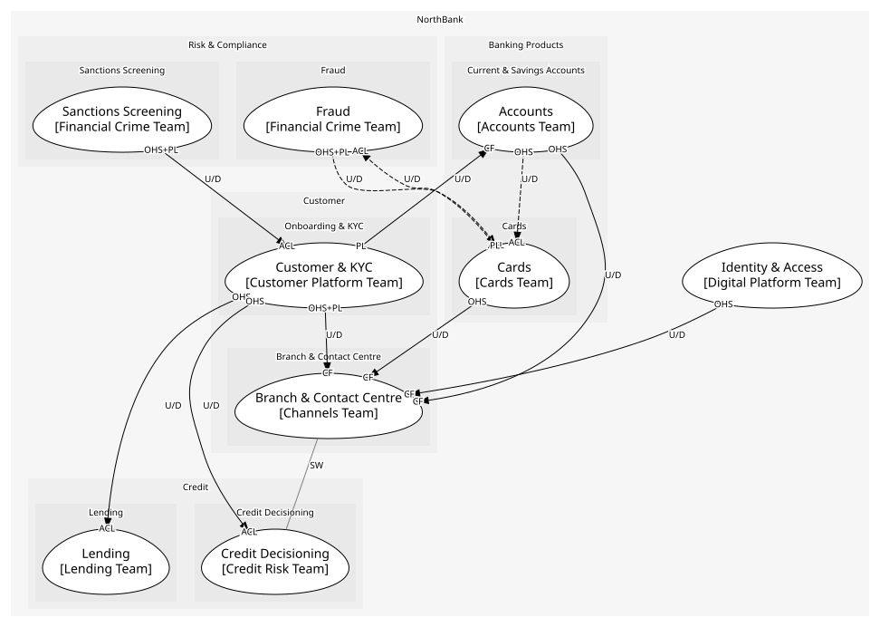

# Customer
Knowing who the customer is, what they agreed to, and serving them

## Subdomains

### [Onboarding & KYC](subdomains/onboarding_&_kyc/index.md) (supporting)
Verifying identity before anything else. Regulated and necessary

### [Consent](subdomains/consent/index.md) (supporting)
Purpose, scope, expiry, withdrawal. A first-class thing since the 2022 fine

### [Branch & Contact Centre](subdomains/branch_&_contact_centre/index.md) (supporting)
Face-to-face and phone service

## Context Relationships
| Upstream | Relationship | Downstream | Upstream Roles | Downstream Roles |
| --- | --- | --- | --- | --- |
| Sanctions Screening | upstream-downstream | Customer & KYC | open-host-service, published-language | anti-corruption-layer |
| Customer & KYC | upstream-downstream | Accounts | published-language | conformist |
| Customer & KYC | upstream-downstream | Lending | open-host-service | anti-corruption-layer |
| Customer & KYC | upstream-downstream | Credit Decisioning | open-host-service | anti-corruption-layer |
| Customer & KYC | upstream-downstream | Branch & Contact Centre | open-host-service, published-language | conformist |
| Accounts | upstream-downstream | Branch & Contact Centre | open-host-service | conformist |
| Cards | upstream-downstream | Branch & Contact Centre | open-host-service | conformist |
| Identity & Access | upstream-downstream | Branch & Contact Centre | open-host-service | conformist |
| Branch & Contact Centre | separate-ways | Credit Decisioning | - | - |
| Accounts | upstream-downstream (implied) | Cards | open-host-service | anti-corruption-layer |
| Fraud | upstream-downstream (implied) | Cards | open-host-service, published-language | anti-corruption-layer |

## Consumptions
| Consumer | Consumed As | Provider | Consumable | Provided As |
| --- | --- | --- | --- | --- |
| [LoanApplication](../../boundedcontexts/lending/aggregates/loan_application/index.md) | anti-corruption-layer | OnboardingApp | GetCustomer | open-host-service |
| [CreditDecision](../../boundedcontexts/credit_decisioning/aggregates/credit_decision/index.md) | anti-corruption-layer | OnboardingApp | GetCustomer | open-host-service |
| [ServiceRequest](../../boundedcontexts/branch_&_contact_centre/aggregates/service_request/index.md) | conformist | OnboardingApp | GetCustomer | open-host-service |
| [KycScreening](../../boundedcontexts/customer_&_kyc/services/kyc_screening/index.md) | anti-corruption-layer | ScreeningResult | ScreenParty | open-host-service |
| [Account](../../boundedcontexts/accounts/aggregates/account/index.md) | conformist | Customer | CustomerVerified | published-language |
| [Customer](../../boundedcontexts/customer_&_kyc/aggregates/customer/index.md) | anti-corruption-layer | ScreeningResult | PartyMatched | published-language |
| [ServiceRequest](../../boundedcontexts/branch_&_contact_centre/aggregates/service_request/index.md) | conformist | Consent | ConsentWithdrawn | published-language |
| [ServiceRequest](../../boundedcontexts/branch_&_contact_centre/aggregates/service_request/index.md) | conformist | AccountServicing | GetAvailableBalance | open-host-service |
| [ServiceRequest](../../boundedcontexts/branch_&_contact_centre/aggregates/service_request/index.md) | conformist | Card | BlockCard | open-host-service |
| [Card](../../boundedcontexts/cards/aggregates/card/index.md) | anti-corruption-layer | AccountServicing | GetAvailableBalance | open-host-service |
| [Card](../../boundedcontexts/cards/aggregates/card/index.md) | anti-corruption-layer | TransactionScorer | ScoreTransaction | open-host-service |
| [Card](../../boundedcontexts/cards/aggregates/card/index.md) | anti-corruption-layer | TransactionScorer | TransactionFlagged | published-language |
| [ServiceRequest](../../boundedcontexts/branch_&_contact_centre/aggregates/service_request/index.md) | anti-corruption-layer | CreditDecision | Decide | open-host-service |
| [ServiceRequest](../../boundedcontexts/branch_&_contact_centre/aggregates/service_request/index.md) | conformist | Credential | AuthenticateCustomer | open-host-service |

	
