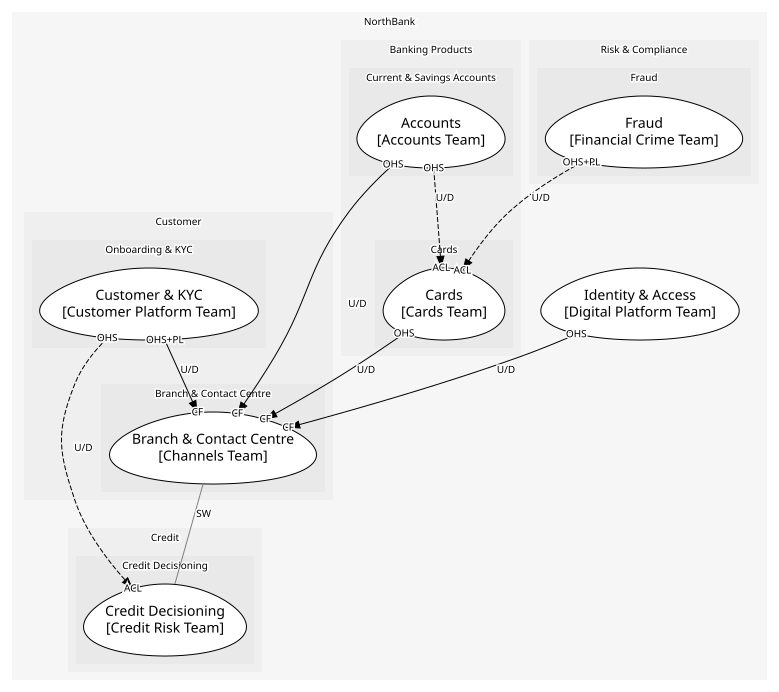

# Branch & Contact Centre (supporting)
Face-to-face and phone service

## Bounded Contexts

### [Branch & Contact Centre](../../../../boundedcontexts/branch_&_contact_centre/index.md)
Service requests raised in branches and on the phone

## Context Relationships
| Upstream | Relationship | Downstream | Upstream Roles | Downstream Roles |
| --- | --- | --- | --- | --- |
| Customer & KYC | upstream-downstream | Branch & Contact Centre | open-host-service, published-language | conformist |
| Accounts | upstream-downstream | Branch & Contact Centre | open-host-service | conformist |
| Cards | upstream-downstream | Branch & Contact Centre | open-host-service | conformist |
| Identity & Access | upstream-downstream | Branch & Contact Centre | open-host-service | conformist |
| Branch & Contact Centre | separate-ways | Credit Decisioning | - | - |
| Accounts | upstream-downstream (implied) | Cards | open-host-service | anti-corruption-layer |
| Fraud | upstream-downstream (implied) | Cards | open-host-service, published-language | anti-corruption-layer |
| Customer & KYC | upstream-downstream (implied) | Credit Decisioning | open-host-service | anti-corruption-layer |

## Consumptions
| Consumer | Consumed As | Provider | Consumable | Provided As |
| --- | --- | --- | --- | --- |
| [ServiceRequest](../../../../boundedcontexts/branch_&_contact_centre/aggregates/service_request/index.md) | conformist | OnboardingApp | GetCustomer | open-host-service |
| [ServiceRequest](../../../../boundedcontexts/branch_&_contact_centre/aggregates/service_request/index.md) | conformist | AccountServicing | GetAvailableBalance | open-host-service |
| [ServiceRequest](../../../../boundedcontexts/branch_&_contact_centre/aggregates/service_request/index.md) | conformist | Card | BlockCard | open-host-service |
| [Card](../../../../boundedcontexts/cards/aggregates/card/index.md) | anti-corruption-layer | AccountServicing | GetAvailableBalance | open-host-service |
| [Card](../../../../boundedcontexts/cards/aggregates/card/index.md) | anti-corruption-layer | TransactionScorer | ScoreTransaction | open-host-service |
| [Card](../../../../boundedcontexts/cards/aggregates/card/index.md) | anti-corruption-layer | TransactionScorer | TransactionFlagged | published-language |
| [ServiceRequest](../../../../boundedcontexts/branch_&_contact_centre/aggregates/service_request/index.md) | conformist | Consent | ConsentWithdrawn | published-language |
| [ServiceRequest](../../../../boundedcontexts/branch_&_contact_centre/aggregates/service_request/index.md) | anti-corruption-layer | CreditDecision | Decide | open-host-service |
| [CreditDecision](../../../../boundedcontexts/credit_decisioning/aggregates/credit_decision/index.md) | anti-corruption-layer | OnboardingApp | GetCustomer | open-host-service |
| [ServiceRequest](../../../../boundedcontexts/branch_&_contact_centre/aggregates/service_request/index.md) | conformist | Credential | AuthenticateCustomer | open-host-service |
	
	
