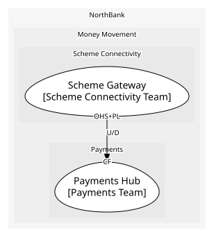

# Scheme Connectivity (generic)
Gateways in the schemes' formats

## Bounded Contexts

### [Scheme Gateway](../../../../boundedcontexts/scheme_gateway/index.md)
ISO 20022 messages to and from the schemes

## Context Relationships
| Upstream | Relationship | Downstream | Upstream Roles | Downstream Roles |
| --- | --- | --- | --- | --- |
| Scheme Gateway | upstream-downstream | Payments Hub | open-host-service, published-language | conformist |

## Consumptions
| Consumer | Consumed As | Provider | Consumable | Provided As |
| --- | --- | --- | --- | --- |
| [PaymentInstruction](../../../../boundedcontexts/payments_hub/aggregates/payment_instruction/index.md) | conformist | SchemeMessage | SchemeSettlementConfirmed | published-language |
| [PaymentInstruction](../../../../boundedcontexts/payments_hub/aggregates/payment_instruction/index.md) | conformist | SchemeMessage | SchemeRejected | published-language |
| [PaymentInstruction](../../../../boundedcontexts/payments_hub/aggregates/payment_instruction/index.md) | conformist | SchemeMessage | SubmitToScheme | open-host-service |
	
	
