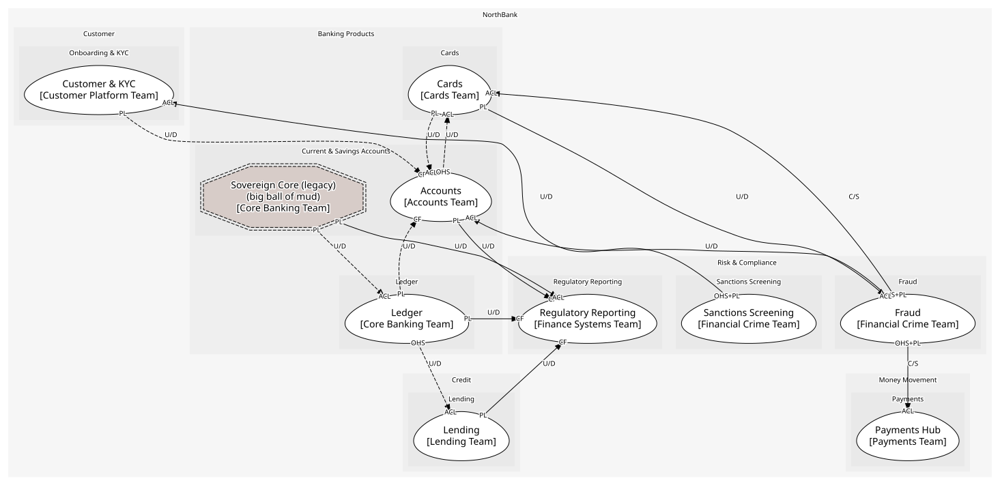

# Risk & Compliance
Financial crime and the regulator

## Subdomains

### [Fraud](subdomains/fraud/index.md) (core)
Every missed flag is the bank's money

### [Sanctions Screening](subdomains/sanctions_screening/index.md) (generic)
Bought lists, bought engine

### [Regulatory Reporting](subdomains/regulatory_reporting/index.md) (supporting)
Returns to the PCA, reconciled to the ledger

## Context Relationships
| Upstream | Relationship | Downstream | Upstream Roles | Downstream Roles |
| --- | --- | --- | --- | --- |
| Sanctions Screening | upstream-downstream | Customer & KYC | open-host-service, published-language | anti-corruption-layer |
| Fraud | customer-supplier | Payments Hub | open-host-service, published-language | anti-corruption-layer |
| Fraud | customer-supplier | Cards | open-host-service, published-language | anti-corruption-layer |
| Cards | upstream-downstream | Fraud | published-language | anti-corruption-layer |
| Fraud | upstream-downstream | Accounts | published-language | anti-corruption-layer |
| Ledger | upstream-downstream | Regulatory Reporting | published-language | conformist |
| Accounts | upstream-downstream | Regulatory Reporting | published-language | conformist |
| Lending | upstream-downstream | Regulatory Reporting | published-language | conformist |
| Sovereign Core (legacy) | upstream-downstream | Regulatory Reporting | published-language | anti-corruption-layer |
| Accounts | upstream-downstream (implied) | Cards | open-host-service | anti-corruption-layer |
| Sovereign Core (legacy) | upstream-downstream (implied) | Ledger | published-language | anti-corruption-layer |
| Customer & KYC | upstream-downstream (implied) | Accounts | published-language | conformist |
| Ledger | upstream-downstream (implied) | Accounts | published-language | conformist |
| Cards | upstream-downstream (implied) | Accounts | published-language | anti-corruption-layer |
| Ledger | upstream-downstream (implied) | Lending | open-host-service | anti-corruption-layer |

## Consumptions
| Consumer | Consumed As | Provider | Consumable | Provided As |
| --- | --- | --- | --- | --- |
| [PaymentInstruction](../../boundedcontexts/payments_hub/aggregates/payment_instruction/index.md) | anti-corruption-layer | TransactionScorer | TransactionFlagged | published-language |
| [Card](../../boundedcontexts/cards/aggregates/card/index.md) | anti-corruption-layer | TransactionScorer | TransactionFlagged | published-language |
| [PaymentInstruction](../../boundedcontexts/payments_hub/aggregates/payment_instruction/index.md) | anti-corruption-layer | TransactionScorer | TransactionCleared | published-language |
| [PaymentInstruction](../../boundedcontexts/payments_hub/aggregates/payment_instruction/index.md) | anti-corruption-layer | TransactionScorer | ScoreTransaction | open-host-service |
| [Card](../../boundedcontexts/cards/aggregates/card/index.md) | anti-corruption-layer | TransactionScorer | ScoreTransaction | open-host-service |
| [Account](../../boundedcontexts/accounts/aggregates/account/index.md) | anti-corruption-layer | FraudCase | FraudCaseOpened | published-language |
| [FraudCase](../../boundedcontexts/fraud/aggregates/fraud_case/index.md) | anti-corruption-layer | Card | CardAuthorised | published-language |
| [Card](../../boundedcontexts/cards/aggregates/card/index.md) | anti-corruption-layer | AccountServicing | GetAvailableBalance | open-host-service |
| [Customer](../../boundedcontexts/customer_&_kyc/aggregates/customer/index.md) | anti-corruption-layer | ScreeningResult | PartyMatched | published-language |
| [KycScreening](../../boundedcontexts/customer_&_kyc/services/kyc_screening/index.md) | anti-corruption-layer | ScreeningResult | ScreenParty | open-host-service |
| [RegulatoryReturn](../../boundedcontexts/regulatory_reporting/aggregates/regulatory_return/index.md) | conformist | JournalEntry | EntryPosted | published-language |
| [JournalEntry](../../boundedcontexts/ledger/aggregates/journal_entry/index.md) | anti-corruption-layer | SavingsAccountRecord | NightlyBatchCompleted | published-language |
| [RegulatoryReturn](../../boundedcontexts/regulatory_reporting/aggregates/regulatory_return/index.md) | conformist | Account | AccountOpened | published-language |
| [Account](../../boundedcontexts/accounts/aggregates/account/index.md) | conformist | Customer | CustomerVerified | published-language |
| [Account](../../boundedcontexts/accounts/aggregates/account/index.md) | conformist | JournalEntry | EntryPosted | published-language |
| [Account](../../boundedcontexts/accounts/aggregates/account/index.md) | anti-corruption-layer | Card | CardAuthorised | published-language |
| [RegulatoryReturn](../../boundedcontexts/regulatory_reporting/aggregates/regulatory_return/index.md) | conformist | Loan | LoanDisbursed | published-language |
| [Loan](../../boundedcontexts/lending/aggregates/loan/index.md) | anti-corruption-layer | JournalEntry | PostEntry | open-host-service |
| [RegulatoryReturn](../../boundedcontexts/regulatory_reporting/aggregates/regulatory_return/index.md) | anti-corruption-layer | SavingsAccountRecord | NightlyBatchCompleted | published-language |

	
