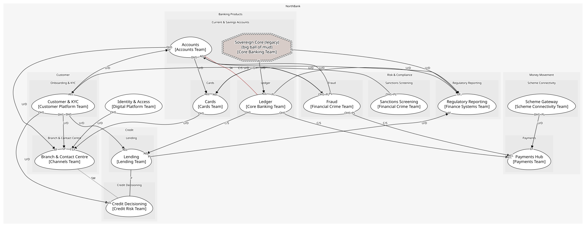

# NorthBank
A fictional retail bank: onboarding and KYC, consent, accounts and ledger, payments and schemes, cards, lending and credit decisioning, fraud, sanctions, regulatory reporting, branches and contact centre, and a legacy core.

[Glossary](./glossary.md)

## Domains

### [Customer](../domains/customer/index.md)
Knowing who the customer is, what they agreed to, and serving them

### [Banking Products](../domains/banking_products/index.md)
Accounts, the ledger beneath them, and cards

### [Money Movement](../domains/money_movement/index.md)
Instructions in, settlements out

### [Credit](../domains/credit/index.md)
Lending the bank's money well

### [Risk & Compliance](../domains/risk_&_compliance/index.md)
Financial crime and the regulator

### [Platform](../domains/platform/index.md)
Shared technical capabilities

## Diagnostics
| Severity | Rule | Message | Element |
| --- | --- | --- | --- |
| error | separate-ways | "Branch & Contact Centre" consumes "Decide" from "Credit Decisioning" although the contexts declare separate ways | `boundedcontexts/branch_&_contact_centre/aggregates/service_request` |
| error | consumable-kind | Policy "Escalate arrears" issues "ArrearsNoticeIssued", which is an event, not an operation | `boundedcontexts/lending/policies/escalate_arrears` |
| warning | context-serves-subdomain | Bounded context "Identity & Access" serves no subdomain, so it is missing from the problem-space view | `boundedcontexts/identity_&_access` |

## Teams
| Team | Owns |
| --- | --- |
| Customer Platform Team | Customer & KYC |
| Financial Crime Team | Sanctions Screening, Fraud |
| Accounts Team | Accounts |
| Core Banking Team | Ledger, Sovereign Core (legacy) |
| Cards Team | Cards |
| Payments Team | Payments Hub |
| Scheme Connectivity Team | Scheme Gateway |
| Lending Team | Lending |
| Credit Risk Team | Credit Decisioning |
| Finance Systems Team | Regulatory Reporting |
| Channels Team | Branch & Contact Centre |
| Digital Platform Team | Identity & Access |

## Context Relationships
| Upstream | Relationship | Downstream | Upstream Roles | Downstream Roles |
| --- | --- | --- | --- | --- |
| Sanctions Screening | upstream-downstream | Customer & KYC | open-host-service, published-language | anti-corruption-layer |
| Customer & KYC | upstream-downstream | Accounts | published-language | conformist |
| Customer & KYC | upstream-downstream | Lending | open-host-service | anti-corruption-layer |
| Customer & KYC | upstream-downstream | Credit Decisioning | open-host-service | anti-corruption-layer |
| Customer & KYC | upstream-downstream | Branch & Contact Centre | open-host-service, published-language | conformist |
| Ledger | customer-supplier | Payments Hub | open-host-service | anti-corruption-layer |
| Ledger | customer-supplier | Lending | open-host-service | anti-corruption-layer |
| Fraud | customer-supplier | Payments Hub | open-host-service, published-language | anti-corruption-layer |
| Fraud | customer-supplier | Cards | open-host-service, published-language | anti-corruption-layer |
| Cards | upstream-downstream | Fraud | published-language | anti-corruption-layer |
| Fraud | upstream-downstream | Accounts | published-language | anti-corruption-layer |
| Scheme Gateway | upstream-downstream | Payments Hub | open-host-service, published-language | conformist |
| Accounts | upstream-downstream | Cards | open-host-service | anti-corruption-layer |
| Cards | upstream-downstream | Accounts | published-language | anti-corruption-layer |
| Accounts | upstream-downstream | Payments Hub | open-host-service | anti-corruption-layer |
| Accounts | upstream-downstream | Branch & Contact Centre | open-host-service | conformist |
| Cards | upstream-downstream | Branch & Contact Centre | open-host-service | conformist |
| Identity & Access | upstream-downstream | Branch & Contact Centre | open-host-service | conformist |
| Ledger | upstream-downstream | Regulatory Reporting | published-language | conformist |
| Accounts | upstream-downstream | Regulatory Reporting | published-language | conformist |
| Lending | upstream-downstream | Regulatory Reporting | published-language | conformist |
| Sovereign Core (legacy) | upstream-downstream | Ledger | published-language | anti-corruption-layer |
| Sovereign Core (legacy) | upstream-downstream | Regulatory Reporting | published-language | anti-corruption-layer |
| Accounts | shared-kernel | Ledger | - | - |
| Lending | partnership | Credit Decisioning | - | - |
| Branch & Contact Centre | separate-ways | Credit Decisioning | - | - |

## Consumptions
| Consumer | Consumed As | Provider | Consumable | Provided As |
| --- | --- | --- | --- | --- |
| [LoanApplication](../boundedcontexts/lending/aggregates/loan_application/index.md) | anti-corruption-layer | OnboardingApp | GetCustomer | open-host-service |
| [CreditDecision](../boundedcontexts/credit_decisioning/aggregates/credit_decision/index.md) | anti-corruption-layer | OnboardingApp | GetCustomer | open-host-service |
| [ServiceRequest](../boundedcontexts/branch_&_contact_centre/aggregates/service_request/index.md) | conformist | OnboardingApp | GetCustomer | open-host-service |
| [KycScreening](../boundedcontexts/customer_&_kyc/services/kyc_screening/index.md) | anti-corruption-layer | ScreeningResult | ScreenParty | open-host-service |
| [Customer](../boundedcontexts/customer_&_kyc/aggregates/customer/index.md) | anti-corruption-layer | ScreeningResult | PartyMatched | published-language |
| [Account](../boundedcontexts/accounts/aggregates/account/index.md) | conformist | Customer | CustomerVerified | published-language |
| [ServiceRequest](../boundedcontexts/branch_&_contact_centre/aggregates/service_request/index.md) | conformist | Consent | ConsentWithdrawn | published-language |
| [ServiceRequest](../boundedcontexts/branch_&_contact_centre/aggregates/service_request/index.md) | conformist | AccountServicing | GetAvailableBalance | open-host-service |
| [PaymentInstruction](../boundedcontexts/payments_hub/aggregates/payment_instruction/index.md) | anti-corruption-layer | AccountServicing | GetAvailableBalance | open-host-service |
| [Card](../boundedcontexts/cards/aggregates/card/index.md) | anti-corruption-layer | AccountServicing | GetAvailableBalance | open-host-service |
| [ServiceRequest](../boundedcontexts/branch_&_contact_centre/aggregates/service_request/index.md) | conformist | Card | BlockCard | open-host-service |
| [FraudCase](../boundedcontexts/fraud/aggregates/fraud_case/index.md) | anti-corruption-layer | Card | CardAuthorised | published-language |
| [Account](../boundedcontexts/accounts/aggregates/account/index.md) | anti-corruption-layer | Card | CardAuthorised | published-language |
| [Card](../boundedcontexts/cards/aggregates/card/index.md) | anti-corruption-layer | TransactionScorer | ScoreTransaction | open-host-service |
| [PaymentInstruction](../boundedcontexts/payments_hub/aggregates/payment_instruction/index.md) | anti-corruption-layer | TransactionScorer | ScoreTransaction | open-host-service |
| [PaymentInstruction](../boundedcontexts/payments_hub/aggregates/payment_instruction/index.md) | anti-corruption-layer | TransactionScorer | TransactionFlagged | published-language |
| [Card](../boundedcontexts/cards/aggregates/card/index.md) | anti-corruption-layer | TransactionScorer | TransactionFlagged | published-language |
| [PaymentInstruction](../boundedcontexts/payments_hub/aggregates/payment_instruction/index.md) | anti-corruption-layer | TransactionScorer | TransactionCleared | published-language |
| [ServiceRequest](../boundedcontexts/branch_&_contact_centre/aggregates/service_request/index.md) | anti-corruption-layer | CreditDecision | Decide | open-host-service |
| [LoanApplication](../boundedcontexts/lending/aggregates/loan_application/index.md) | conformist | CreditDecision | Decide | open-host-service |
| [LoanApplication](../boundedcontexts/lending/aggregates/loan_application/index.md) | conformist | CreditDecision | DecisionMade | published-language |
| [ServiceRequest](../boundedcontexts/branch_&_contact_centre/aggregates/service_request/index.md) | conformist | Credential | AuthenticateCustomer | open-host-service |
| [RegulatoryReturn](../boundedcontexts/regulatory_reporting/aggregates/regulatory_return/index.md) | conformist | Account | AccountOpened | published-language |
| [Account](../boundedcontexts/accounts/aggregates/account/index.md) | conformist | JournalEntry | EntryPosted | published-language |
| [RegulatoryReturn](../boundedcontexts/regulatory_reporting/aggregates/regulatory_return/index.md) | conformist | JournalEntry | EntryPosted | published-language |
| [PaymentInstruction](../boundedcontexts/payments_hub/aggregates/payment_instruction/index.md) | anti-corruption-layer | JournalEntry | PostEntry | open-host-service |
| [Loan](../boundedcontexts/lending/aggregates/loan/index.md) | anti-corruption-layer | JournalEntry | PostEntry | open-host-service |
| [JournalEntry](../boundedcontexts/ledger/aggregates/journal_entry/index.md) | anti-corruption-layer | SavingsAccountRecord | NightlyBatchCompleted | published-language |
| [RegulatoryReturn](../boundedcontexts/regulatory_reporting/aggregates/regulatory_return/index.md) | anti-corruption-layer | SavingsAccountRecord | NightlyBatchCompleted | published-language |
| [Account](../boundedcontexts/accounts/aggregates/account/index.md) | anti-corruption-layer | FraudCase | FraudCaseOpened | published-language |
| [PaymentInstruction](../boundedcontexts/payments_hub/aggregates/payment_instruction/index.md) | conformist | SchemeMessage | SubmitToScheme | open-host-service |
| [PaymentInstruction](../boundedcontexts/payments_hub/aggregates/payment_instruction/index.md) | conformist | SchemeMessage | SchemeSettlementConfirmed | published-language |
| [PaymentInstruction](../boundedcontexts/payments_hub/aggregates/payment_instruction/index.md) | conformist | SchemeMessage | SchemeRejected | published-language |
| [RegulatoryReturn](../boundedcontexts/regulatory_reporting/aggregates/regulatory_return/index.md) | conformist | Loan | LoanDisbursed | published-language |
	

