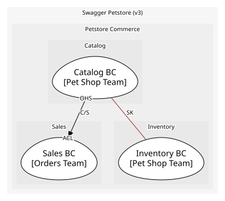

# Catalog BC
Owns the Pet aggregate and the pet-facing operations

**Owned by:** Pet Shop Team

## Serves
- [Petstore Commerce / Catalog](../../domains/petstore_commerce/subdomains/catalog/index.md) (core)

## Glossary
| Term | Definition | Aliases | Embodied by |
| --- | --- | --- | --- |
| **Pet** | An animal listed for sale in the store | - | Pet |
| **Category** | The kind of animal a pet is, such as Dogs or Cats | Species | Category |
| **Available** | A pet that can be ordered; it becomes pending once an order is placed | - | PetStatus |

## Aggregates

### [Pet](aggregates/pet/index.md)
A pet listed in the store. One aggregate because a pet's photos, tags and status change together

	
## Services

### [PetApp](services/pet_app/index.md)
Open-host service for /pet endpoints

## Schemas
| Name | Description | Attributes | Used by |
| --- | --- | --- | --- |
| PetRegistered | What the outside learns when a pet joins the catalog | **petId**: `int64`, name: `string`, category: `Category` | PetRegistered |
| PetStatusChanged | - | **petId**: `int64`, from: `PetStatus`, to: `PetStatus` | PetStatusChanged, ChangePetStatus |
| RegisterPet | Request body for adding a pet | name: `string`, category: `Category` | AddPet |
| PetId | Identifies one pet; shared by every consumable that only needs the id | **petId**: `int64` | PetUpdated, PetDeleted, GetPetById, DeletePet, GetPetSummary |

## Policies
> No policies.

## Context Relationships
| Upstream | Relationship | Downstream | Upstream Roles | Downstream Roles |
| --- | --- | --- | --- | --- |
| Catalog BC | customer-supplier | Sales BC | open-host-service | anti-corruption-layer |
| Catalog BC | shared-kernel | Inventory BC | - | - |

## Consumptions
| Consumer | Consumed As | Provider | Consumable | Provided As |
| --- | --- | --- | --- | --- |
| [OrderApp](../sales_bc/services/order_app/index.md) | anti-corruption-layer | PetApp | GetPetSummary | open-host-service |
| [InventoryProjection](../inventory_bc/aggregates/inventory_projection/index.md) | conformist | Pet | PetRegistered | published-language |
| [InventoryProjection](../inventory_bc/aggregates/inventory_projection/index.md) | conformist | Pet | PetStatusChanged | published-language |
| [InventoryProjection](../inventory_bc/aggregates/inventory_projection/index.md) | conformist | Pet | PetDeleted | published-language |

