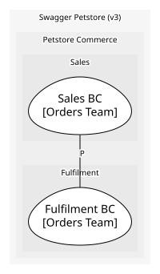

# Fulfilment BC
Plans and tracks the shipment of an approved order until it is delivered

**Owned by:** Orders Team

## Serves
- [Petstore Commerce / Fulfilment](../../domains/petstore_commerce/subdomains/fulfilment/index.md) (supporting)

## Glossary
| Term | Definition | Aliases | Embodied by |
| --- | --- | --- | --- |
| **Shipment** | The consignment that carries one order to its owner | Consignment | Shipment |

## Aggregates

### [Shipment](aggregates/shipment/index.md)
The journey of one approved order to its owner. Attempts live inside it because they mean nothing without the shipment

	
## Services

### [DispatchPlanner](services/dispatch_planner/index.md)
Chooses ship dates across pending shipments so pets of one category travel together

## Schemas
| Name | Description | Attributes | Used by |
| --- | --- | --- | --- |
| ShipmentDelivered | - | **shipmentId**: `int64`, orderId: `int64`, deliveredAt: `date-time` | ShipmentDelivered |

## Policies

| Name | Description | On | Then |
| --- | --- | --- | --- |
| Plan dispatch on approval | Every approved order gets a shipment planned straight away | OrderApproved | PlanDispatch |
| Deliver order on delivery | When a shipment is delivered, mark the order delivered in Sales | ShipmentDelivered | DeliverOrder |

## Context Relationships
| Upstream | Relationship | Downstream | Upstream Roles | Downstream Roles |
| --- | --- | --- | --- | --- |
| Sales BC | partnership | Fulfilment BC | - | - |

## Consumptions
| Consumer | Consumed As | Provider | Consumable | Provided As |
| --- | --- | --- | --- | --- |
| [Shipment](aggregates/shipment/index.md) | conformist | Order | OrderApproved | published-language |

