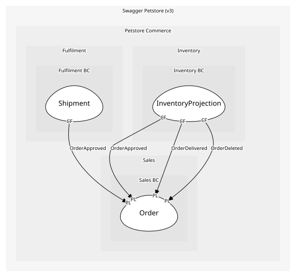

# Order
Order for a single pet

## Entities and Value Objects
| Type | Name | Description | Attributes |
| --- | --- | --- | --- |
| Entity (Root) | **Order** | The customer's request to buy one pet | **id**: `int64`, petId: `int64`, quantity: `Quantity`, shipDate: `ShipDate`, status: `OrderStatus` |
| Value Object | OrderStatus | Where the order is in its lifecycle | value: `'placed' | 'approved' | 'delivered'` |
| Value Object | Quantity | How many of the pet are ordered | value: `int > 0` |
| Value Object | ShipDate | When the order ships; set by Fulfilment once dispatch is planned | value: `date-time` |

## Relationships
| Source | Description | Target | Relation | Cardinality |
| --- | --- | --- | --- | --- |
| [Order](entities/order/index.md) | has-status | Order - OrderStatus | uses | 1 |
| [Order](entities/order/index.md) | has-quantity | Order - Quantity | uses | 1 |
| [Order](entities/order/index.md) | ships-on | Order - ShipDate | uses | 0..1 |
| [Order](entities/order/index.md) | for-pet | Pet - Pet | references | 1 |
| [Pet](../../../catalog_bc/aggregates/pet/entities/pet/index.md) | categorized-as | Pet - Category | uses | 0..1 |
| [Pet](../../../catalog_bc/aggregates/pet/entities/pet/index.md) | tagged-with | Pet - Tag | uses | * |
| [Pet](../../../catalog_bc/aggregates/pet/entities/pet/index.md) | has-photo | Pet - PhotoUrl | uses | 1..* |
| [Pet](../../../catalog_bc/aggregates/pet/entities/pet/index.md) | has-status | Pet - PetStatus | uses | 1 |

## Invariants
| Name | Description | Constrains |
| --- | --- | --- |
| QuantityPositive | Quantity must be > 0; an order for nothing is a mistake, not an order | Quantity |
| ApproveOnlyWhenAvailable | Approve only if Pet.status == available | OrderStatus, PetStatus |
| DeliverOnlyWhenApproved | Deliver only from approved, so nothing ships that was never checked | OrderStatus |

## Provides
| Name | Type | Internal | Pattern | Description | Schema | Raises |
| --- | --- | --- | --- | --- | --- | --- |
| OrderPlaced | event | no | published-language | Order created (status=placed) | [OrderPlaced](../../index.md#schemas) | - |
| OrderApproved | event | no | published-language | Order approved (status=approved); Inventory and Fulfilment both react | [OrderId](../../index.md#schemas) | - |
| OrderDelivered | event | no | published-language | Order delivered (status=delivered) | [OrderId](../../index.md#schemas) | - |
| OrderDeleted | event | no | published-language | Order deleted via DELETE /store/order/{orderId} | [OrderId](../../index.md#schemas) | - |
| ApproveOrder | operation | yes | - | Approve a placed order once the pet is available | [OrderId](../../index.md#schemas) | OrderApproved |
| DeliverOrder | operation | no | open-host-service | Mark an approved order as delivered; issued by Fulfilment when the shipment arrives | [OrderId](../../index.md#schemas) | OrderDelivered |

## Consumes
> No consumptions.
	
