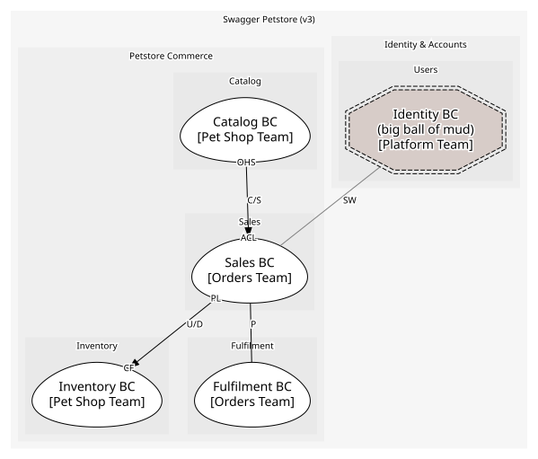
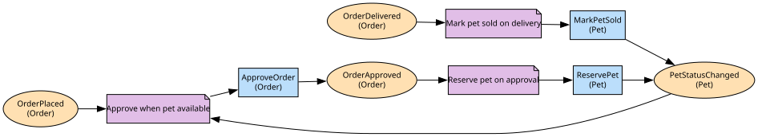

# Sales BC
Owns the Order aggregate and the order-facing operations

**Owned by:** Orders Team

## Serves
- [Petstore Commerce / Sales](../../domains/petstore_commerce/subdomains/sales/index.md) (core)

## Glossary
| Term | Definition | Aliases | Embodied by |
| --- | --- | --- | --- |
| **Order** | A customer's request to buy one pet in a given quantity | Purchase | Order |
| **Approval** | Confirmation that the ordered pet is available and reserved | - | ApproveOrder |

## Aggregates

### [Order](aggregates/order/index.md)
Order for a single pet

	
## Services

### [OrderApp](services/order_app/index.md)
Open-host service for /store/order endpoints

## Schemas
| Name | Description | Attributes | Used by |
| --- | --- | --- | --- |
| OrderPlaced | - | **orderId**: `int64`, petId: `int64`, quantity: `Quantity` | OrderPlaced |
| PlaceOrder | Request body for placing an order | petId: `int64`, quantity: `Quantity` | PlaceOrder |
| OrderId | - | **orderId**: `int64` | OrderApproved, OrderDelivered, OrderDeleted, ApproveOrder, DeliverOrder, GetOrderById, DeleteOrder |

## Policies

| Name | Description | On | Then |
| --- | --- | --- | --- |
| Approve when pet available | When a pet becomes available and an order for it is placed, approve the order | PetStatusChanged, OrderPlaced | ApproveOrder |

## Context Relationships
| Upstream | Relationship | Downstream | Upstream Roles | Downstream Roles |
| --- | --- | --- | --- | --- |
| Catalog BC | customer-supplier | Sales BC | open-host-service | anti-corruption-layer |
| Sales BC | upstream-downstream | Inventory BC | published-language | conformist |
| Sales BC | partnership | Fulfilment BC | - | - |
| Identity BC | separate-ways | Sales BC | - | - |

## Consumptions
| Consumer | Consumed As | Provider | Consumable | Provided As |
| --- | --- | --- | --- | --- |
| [OrderApp](services/order_app/index.md) | anti-corruption-layer | PetApp | GetPetSummary | open-host-service |
| [Shipment](../fulfilment_bc/aggregates/shipment/index.md) | conformist | Order | OrderApproved | published-language |
| [InventoryProjection](../inventory_bc/aggregates/inventory_projection/index.md) | conformist | Order | OrderApproved | published-language |
| [InventoryProjection](../inventory_bc/aggregates/inventory_projection/index.md) | conformist | Order | OrderDelivered | published-language |
| [InventoryProjection](../inventory_bc/aggregates/inventory_projection/index.md) | conformist | Order | OrderDeleted | published-language |

